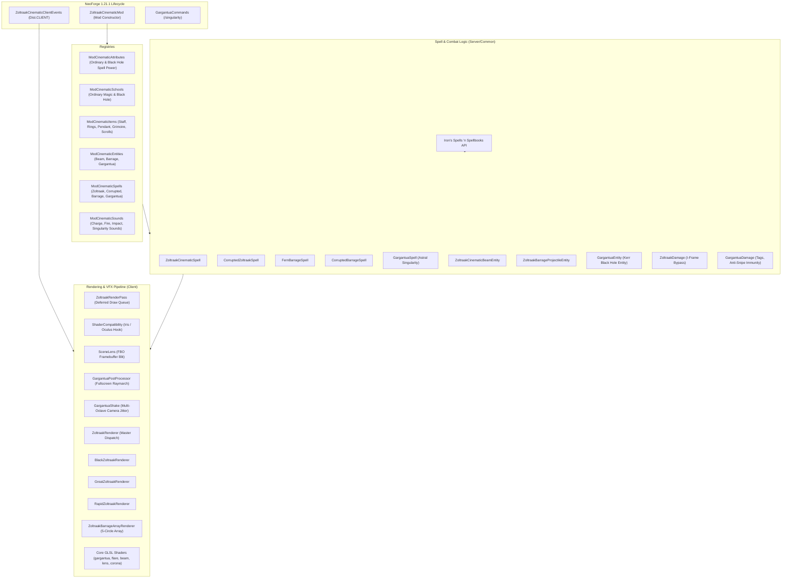
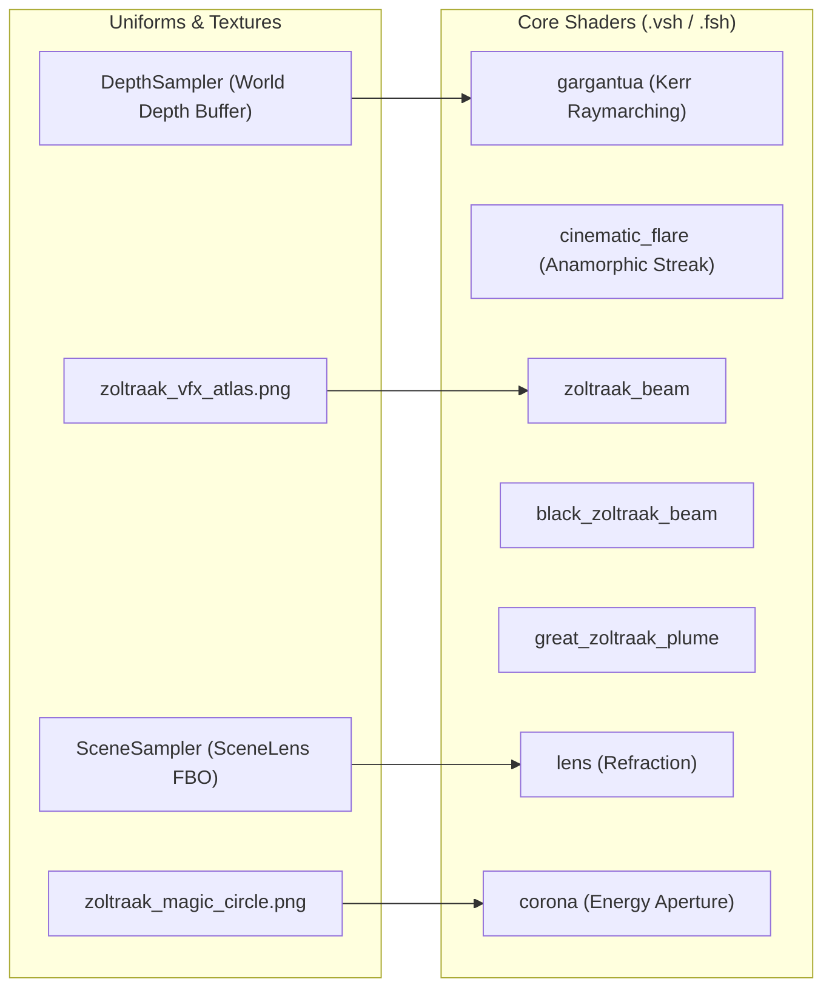

# Zoltraak: Cinematic Edition — Architecture & Technical Documentation
**Version:** 1.0.0 | **Minecraft:** 1.21.1 | **Mod Loader:** NeoForge 21.1.248+ | **Target API:** Iron's Spells 'n Spellbooks

---

## 1. Executive Summary & Vision

**Zoltraak: Cinematic Edition** is a visual and mechanical addon for *Iron's Spells 'n Spellbooks (ISS)* on Minecraft 1.21.1 (NeoForge). Its design goal is to deliver a 1:1 anime-accurate recreation of the iconic "Ordinary Offensive Magic" (*Zoltraak / ゾルトラーク*) from *Frieren: Beyond Journey's End* (*Sousou no Frieren*), alongside the cosmic **Astral Singularity: Gargantua** — a general-relativistic rotating Kerr black hole spell with cinematic fidelity, screen-space dynamics, and balanced gameplay integration.

The mod achieves this through:
- **Zero-Black-Smoke Energy Ionization**: Pure photonic plasma and star dust aesthetics.
- **Multi-Circle Orbital Array**: 5 runic circles arranged in 3D local coordinate space for continuous rapid barrage.
- **Astral Singularity (Gargantua)**: Full 4th-order Kerr geodesic raymarching, Doppler-beamed volumetric accretion disk, Thorne metric event horizon, frame dragging, and cataclysmic supernova blast.
- **Custom Core GLSL 150 Shaders**: Procedural ray rippling, FBM dark soot noise, gravitational lensing, cinematic anamorphic flares, and volumetric plumes.
- **Deferred Render Pass & Screen-Space Pipeline**: Overriding standard rendering via `AFTER_SKY` and `AFTER_LEVEL` passes for flicker-free translucent depth sorting, and post-processor framebuffer blitting.
- **Zero-Crash Decoupling & Shader Compatibility**: Dynamic reflection fallback and seamless compatibility with Iris / Oculus shader packs.

---

## 2. High-Level Architecture Diagram



---

## 3. Directory & Package Structure

```
zoltraak-cinematic/
├── build.py                                  # Standalone Python + JDK 21 build & auto-deployment pipeline
├── zoltraak_cinematic-neoforge-1.21.1-1.0.0.jar # Compiled mod artifact
├── libs/                                     # NeoForge and runtime dependency jars
├── reverse_engineering/                      # Source reference implementations (frierenvoid)
└── src/main/
    ├── java/com/frierenflight/zoltraakcinematic/
    │   ├── ZoltraakCinematicMod.java         # Mod entry point & creative tab registration
    │   ├── ZoltraakDamage.java               # I-Frame bypass & damage application utility
    │   ├── client/
    │   │   ├── ZoltraakCinematicClientEvents.java # Camera shake, flash overlay, tick listeners
    │   │   └── renderer/
    │   │       ├── GargantuaPostProcessor.java   # Fullscreen Kerr black hole raymarch post-processor
    │   │       ├── GargantuaShake.java           # Multi-octave continuous & blast camera rumble
    │   │       ├── GargantuaRenderer.java        # EntityRenderer fallback & bounding box anchor
    │   │       ├── IZoltraakVisualEntity.java    # Standardized visual interface
    │   │       ├── ZoltraakMode.java             # SINGLE, RAPID, LARGE definitions
    │   │       ├── ZoltraakColorTheme.java       # DEMON_SLAYING vs HUMAN_KILLING palettes
    │   │       ├── ZoltraakRenderPass.java       # Deferred rendering queue
    │   │       ├── ZoltraakRenderTypes.java      # Custom Blaze3D RenderTypes
    │   │       ├── ZoltraakCinematicShaders.java # ShaderInstance registration
    │   │       ├── ShaderCompatibility.java      # Iris/Oculus dynamic reflection API
    │   │       ├── SceneLens.java                # Off-screen scene capture for refraction
    │   │       ├── ZoltraakRenderer.java         # Primary Zoltraak beam renderer
    │   │       ├── BlackZoltraakRenderer.java    # Corrupted beam renderer
    │   │       ├── GreatZoltraakRenderer.java    # High-yield volumetric beam renderer
    │   │       ├── RapidZoltraakRenderer.java    # Barrage projectile renderer
    │   │       ├── ZoltraakBarrageArrayRenderer.java # 5-Circle orbital caster array
    │   │       ├── ZoltraakBarrageProjectileRenderer.java # EntityRenderer wrapper
    │   │       └── ZoltraakPhotonBeamRenderer.java     # EntityRenderer wrapper
    │   ├── command/
    │   │   └── GargantuaCommands.java        # /singularity, /gargantua debug & spawn commands
    │   ├── config/
    │   │   └── ZoltraakCinematicConfig.java  # Client & server configurable parameters
    │   ├── entity/
    │   │   ├── ZoltraakCinematicBeamEntity.java  # Continuous piercing raycast entity
    │   │   ├── ZoltraakBarrageProjectileEntity.java # High-speed projectile entity
    │   │   ├── GargantuaEntity.java          # Rotating Kerr black hole singularity entity
    │   │   └── GargantuaDamage.java          # Custom damage type source with anti-snipe bypass
    │   ├── item/
    │   │   ├── FrierenStaffItem.java             # 3D Staff with attribute modifiers
    │   │   ├── MirrorLotusRingItem.java          # Curios ring with CDR & spell power
    │   │   ├── ManaConcealmentPendantItem.java   # Curios necklace with resistance
    │   │   └── OrdinaryGrimoireItem.java         # 10-slot spellbook focus
    │   ├── registry/
    │   │   ├── ModCinematicAttributes.java       # Player custom attribute modifiers (Zoltraak, Black Hole)
    │   │   ├── ModCinematicEntities.java         # Beam, projectile, and Gargantua entities
    │   │   ├── ModCinematicItems.java            # Mod items (Staff, rings, grimoire, scrolls)
    │   │   ├── ModCinematicSchools.java          # Ordinary Magic & Black Hole Magic schools
    │   │   ├── ModCinematicSounds.java           # Custom acoustic events (Charge, fire, hum, explode, tinnitus)
    │   │   └── ModCinematicSpells.java           # Spell definitions
    │   └── spell/
    │       ├── ZoltraakCinematicSpell.java       # Standard Frieren Zoltraak
    │       ├── CorruptedZoltraakSpell.java       # Qual Human-Killing Zoltraak
    │       ├── FernBarrageSpell.java             # Fern 10/s rapid barrage
    │       ├── CorruptedBarrageSpell.java        # Dark barrage variant
    │       └── GargantuaSpell.java               # Astral Singularity: Gargantua spell
    └── resources/
        ├── META-INF/neoforge.mods.toml           # NeoForge mod metadata
        ├── assets/zoltraak_cinematic/
        │   ├── lang/ (en_us.json, th_th.json)    # English and Thai localizations
        │   ├── models/item/                      # 3D item models
        │   ├── shaders/core/                     # GLSL 150 vertex & fragment shaders (gargantua, flare, beam)
        │   ├── textures/ (spell, entity, item)   # VFX atlases, runes, ring icons, scroll icons
        │   └── sounds.json & sounds/             # Custom sound assets
        └── data/
            ├── c/tags/damage_type/               # Common tags (#c:is_magic)
            ├── minecraft/tags/damage_type/       # Minecraft tags (bypasses_shield, bypasses_armor, etc.)
            ├── neoforge/tags/damage_type/        # NeoForge tags (#neoforge:is_magic)
            └── zoltraak_cinematic/               # Recipes, curios, school foci tags
```

---

## 4. Domain & Registry System

### 4.1 Magic Schools

#### 4.1.1 Ordinary Magic (`ordinary_magic`)
- **Resource Location:** `zoltraak_cinematic:ordinary_magic`
- **Focus Tag:** `#zoltraak_cinematic:ordinary_magic_focus`
- **Color Theme:** Cyan (`#00E5FF`)
- **Key Attributes:**
  - `attribute.zoltraak_cinematic.zoltraak_spell_power`: Increases damage of all Ordinary Magic spells.
  - `attribute.zoltraak_cinematic.zoltraak_magic_resist`: Decreases incoming Ordinary Magic damage.

#### 4.1.2 Black Hole Magic (`black_hole`)
- **Resource Location:** `zoltraak_cinematic:black_hole`
- **Focus Tag:** `#zoltraak_cinematic:black_hole_focus`
- **Color Theme:** Deep Cosmic Violet (`#1A0B2E` / `#7B2CBF`)
- **Key Attributes:**
  - `attribute.zoltraak_cinematic.black_hole_spell_power`: Directly multiplies the apocalyptic supernova blast and continuous tidal/plasma damage of Black Hole magic.
  - `attribute.zoltraak_cinematic.black_hole_magic_resist`: Decreases incoming Black Hole and gravitational shear damage.

### 4.2 Spells Overview

| Spell ID | Class | Cast Type | Mana | Cooldown | Key Features |
| :--- | :--- | :--- | :--- | :--- | :--- |
| `zoltraak` | `ZoltraakCinematicSpell` | `INSTANT` | 40 (+6/lvl) | 4.0s | 64m piercing photonic beam, 12m terminal shockwave, shield breaking, crater carving. |
| `corrupted_zoltraak` | `CorruptedZoltraakSpell` | `INSTANT` | 48 (+7/lvl) | 4.5s | Dark void beam, armor bypass, inflicts Wither & Slowness, electric magenta flares. |
| `zoltraak_barrage` | `FernBarrageSpell` | `CONTINUOUS` (3s) | 22 (+3/lvl) | 1.0s | 10 shots/s across 5 floating magic circles, 56 m/s supersonic projectiles, micro-stagger. |
| `corrupted_barrage` | `CorruptedBarrageSpell` | `CONTINUOUS` (3s) | 28 (+4/lvl) | 1.2s | High-frequency dark thorn projectiles, dark decay, shield bypass. |
| `gargantua` | `GargantuaSpell` | `LONG` (4.0s) | 2,500 | 600.0s | Astral Singularity: Kerr black hole, 100m pull field, 0–32m accretion disk damage, zero item deletion, boss anti-snipe immunity, tick 1100 supernova detonation. |

### 4.3 Custom Items & Equipment

1. **Frieren's Staff (`frieren_staff`)**:
   - Custom 3D voxel model with handcrafted display transforms.
   - **Modifiers (Mainhand):** +6.0 Attack Damage, +45% Spell Power, +35% Zoltraak Spell Power, +500 Max Mana, +20% Cooldown Reduction.
2. **Ring of the Mirror Lotus (`mirror_lotus_ring`)**:
   - Curios Ring slot item.
   - **Modifiers:** +25% Zoltraak Spell Power, +15% Cooldown Reduction, +150 Max Mana, +1.0 Mana Regen.
3. **Mana Concealment Pendant (`mana_concealment_pendant`)**:
   - Curios Necklace slot item.
   - **Modifiers:** +20% Zoltraak Magic Resistance, +10% Cast Time Reduction, +200 Max Mana.
4. **Grimoire of Ordinary Magic (`ordinary_grimoire`)**:
   - Elite 10-slot Spellbook focus item.
   - **Modifiers:** +30% Zoltraak Spell Power, +15% Universal Spell Power, +300 Max Mana, +15% Cooldown Reduction.
5. **Affinity Ring of the Black Hole (`affinity_ring_black_hole`)**:
   - Curios Ring slot item with custom animated cosmic void gemstone.
   - **Modifiers:** +20% Black Hole Spell Power, +15% Universal Spell Power, +200 Max Mana, +1.5 Mana Regen.
6. **Ancient Dragon Scroll: Astral Singularity (`scroll_black_hole`)**:
   - Legendary spell scroll crafted using the Ender Dragon Egg (`minecraft:dragon_egg`) + Nether Star + Crying Obsidian + Echo Shard.

---

## 5. Entities & Combat Mathematics

### 5.1 `ZoltraakCinematicBeamEntity`
- **Lifetime:** 46 ticks (2.3s total; charge period: 14 ticks / 0.70s; discharge duration: 9 ticks).
- **Positioning & Staff Anchor:**
  While charging, real-time positional updates sync to the caster's staff anchor:
  $$\vec{P}_{anchor} = \vec{P}_{eye} + 0.32\hat{R} - 0.22\hat{Y} + 1.25\hat{D}$$
  *(where $\hat{R}$ is the view right vector and $\hat{D}$ is the look direction vector).*
- **Dynamic Raycast Piercing:**
  Calculates distance iteratively along the look vector up to 64 blocks, stopping only when encountering blocks with `destroySpeed > 1.5` (or $> 40.0$ in `LARGE` mode).
- **Terminal Blast & Falloff Damage:**
  Entities within the blast radius ($R=12.0\text{m}$, or $21.0\text{m}$ in large mode) receive distance-attenuated damage:
  $$\text{Damage}(d) = \max\left(12.0,\, \text{SpellDamage} \times \left(1.0 - \frac{d}{R}\right) \times \text{Multiplier}\right)$$
- **Shield Disabling:** Directly calls `Player#disableShield()` on blocking targets.
- **Crater Carving:** Governed by `GameRules.RULE_MOBGRIEFING`, clearing blocks within radius 4 ($R=7$ for large) excluding unbreakable blocks (Obsidian, Bedrock).

### 5.2 `ZoltraakBarrageProjectileEntity`
- **Velocity:** 56 m/s (`deltaMovement = 2.8` blocks/tick).
- **Path History Tracking:** Maintains an interpolation point list `pathHistory` allowing `RapidZoltraakRenderer` to construct smooth, curved ribbons behind moving projectiles.
- **I-Frame Bypass (`ZoltraakDamage`):**
  Temporarily clears `invulnerableTime = 0` during damage application and restores it safely in a `finally` block, ensuring every hit in a 10-shot-per-second stream registers reliably.

### 5.3 `GargantuaEntity` (Astral Singularity / Kerr Gravitational Metric)

`GargantuaEntity` implements a supermassive rotating Kerr black hole governed by general relativistic spacetime geometry, volumetric accretion dynamics, and a cataclysmic multi-phase lifecycle.

- **Relativistic Spacetime Parameters**:
  - **Gravitational Radius ($r_g$):** $4.0\text{m}$ (spatial scale unit in blocks).
  - **Dimensionless Kerr Spin ($a/M$):** $0.60$ (retrograde/prograde frame dragging vector).
  - **Event Horizon Radius ($r_h$):** $1.8 r_g = 7.2\text{m}$ (infinite redshift surface).
  - **Innermost Stable Circular Orbit (ISCO):** $3.83 r_g = 15.32\text{m}$ (inner accretion disk boundary).
  - **Apparent Optical Shadow Radius ($r_{\text{shadow}}$):** $5.196 r_g = 20.78\text{m}$.
  - **Accretion Disk Outer Radius ($r_{\text{disk}}$):** $13.5 r_g = 54.0\text{m}$ (continuous active damage boundary at $32.0\text{m}$).
  - **Gravitational Pull Field Radius ($R_{\text{pull}}$):** $100.0\text{m}$ (inverse-distance accelerated infall).

- **5-Phase Lifecycle Timeline (1,200 ticks / 60.0s total)**:
  1. **Phase 1: Spacetime Tear (Ticks 0–60 / 0–3.0s)**:
     Opening cosmic fissure expands from $0.15 r_g$ to full $r_g = 4.0\text{m}$ with smoothstep interpolation. Plays `ModCinematicSounds.SINGULARITY_CHARGE`. Surface terrain blocks are lifted and tracked in `tornBlocks` map.
  2. **Phase 2: Relativistic Infall & Accretion Vortex (Ticks 60–1060 / 3.0–53.0s)**:
     Full gravitational field active. Ambient cosmic hum resonates every 40 ticks (`ModCinematicSounds.SINGULARITY_ACTIVE`). Frame dragging applies tangential velocity swirl $\vec{v}_{\text{tangent}} = \hat{\omega} \times \hat{r}_{\text{inward}}$.
  3. **Phase 3: Critical Gravitational Implosion (Ticks 1060–1100 / 53.0–55.0s)**:
     The singularity core compresses inward ($r_g \to 1.8\text{m}$) as tidal forces destabilize. Overheats into brilliant violet-white supercritical plasma with accelerated screen-shake.
  4. **Phase 4: Apocalyptic Supernova Detonation (Tick 1100 / 55.0s)**:
     Core blows open ($r_g \to 6.0\text{m}$), discharging a cataclysmic gamma-ray shockwave (`SINGULARITY_EXPLODE`, `TINNITUS`). Clears swirling debris and applies distance-attenuated damage across a 32m radius.
  5. **Phase 5: Cosmic Dissolution & Spacetime Healing (Ticks 1115–1200 / 55.75–60.0s)**:
     Exponential visual fade. All blocks torn from the terrain are restored cleanly to the world via `restoreTornBlocks()` (zero permanent terrain griefing).

- **Dual-Zone Continuous Accretion Damage Architecture**:
  Distance is evaluated using the closest point on the entity's bounding box surface rather than its foot origin, ensuring massive bosses (e.g., Netherite Monstrosity, Ignis, Leviathan, Ender Dragon) are accurately damaged:
  $$d_{\text{box}} = \sqrt{\text{AABB}.\text{distanceToSqr}(\vec{P}_{\text{center}})}$$
  - **Zone 1: Event Horizon Core ($d_{\text{box}} \le 7.2\text{m}$)**:
    $$\text{Damage}_{\text{tidal}} = \max\left(35.0,\, \text{MaxHP} \times 20\%\right) \quad (\text{every 8 ticks / 0.4s})$$
  - **Zone 2: Accretion Disk Relativistic Plasma ($7.2\text{m} < d_{\text{box}} \le 32.0\text{m}$)**:
    $$\text{Factor}_{\text{plasma}} = 0.30 + 0.70 \times \left(\frac{32.0 - d_{\text{box}}}{32.0 - 7.2}\right)$$
    $$\text{Damage}_{\text{plasma}} = \max\left(20.0,\, \text{MaxHP} \times (20\% \times \text{Factor}_{\text{plasma}})\right) \quad (\text{every 8 ticks / 0.4s})$$

- **Boss Anti-Cheese & Anti-Snipe Immunity System**:
  - Many boss mods (e.g., Cataclysm) inspect `damageSource.getEntity()` and cancel incoming damage if the attacker is a player located beyond their combat engagement radius (e.g. $> 25\text{m}$).
  - `GargantuaDamage` resolves this: for all monsters and bosses, `damageCauser` is set directly to `this` (`GargantuaEntity`), which physically sits adjacent to the boss ($\le 32\text{m}$), bypassing all anti-snipe range caps.
  - Concurrently, `targetLiving.setLastHurtByPlayer(player)` is invoked every tick, guaranteeing 100% full player kill credit, loot table drops, and EXP.

- **Multi-Part Boss Support (`PartEntity<?>`)**:
  - Intercepts `net.neoforged.neoforge.entity.PartEntity<?>` and resolves parent `LivingEntity` (Ender Dragon, Netherite Monstrosity, Ignis, Leviathan).
  - Maintains `Set<UUID> hitTargets` per damage cycle to ensure complex multi-part bosses take legitimate damage without duplicate hit exploit multiplication.

- **Zero Item Deletion Guarantee**:
  - `ItemEntity` instances are completely excluded from void discard/swallowing logic. Items swirl safely within the accretion vortex and remain intact for player recovery.

- **Supernova Detonation Blast Formula**:
  $$\text{Damage}_{\text{blast}} = \left(\text{BaseBlastDamage} \times \frac{\text{BlackHoleSpellPower}}{500.0} + \min(\text{SwallowedCount} \times 10, 200)\right) \times \max\left(0.25,\, 1.0 - \frac{d_{\text{box}}}{R_{\text{blast}}}\right)$$
  - Equipped with damage tags: `#minecraft:bypasses_shield`, `#minecraft:bypasses_armor`, `#minecraft:bypasses_wolf_armor`, `#minecraft:always_hurts_ender_dragons`, `#minecraft:is_magic`, `#neoforge:is_magic`, `#c:is_magic`.

---

## 6. Client Rendering & Visual Architecture

### 6.1 Deferred Render Pass (`ZoltraakRenderPass`)
Minecraft's default entity rendering stage can cause depth-sorting artifacts with custom blended additive quads. `ZoltraakRenderPass` intercepts Zoltraak entity render calls:
1. `AFTER_SKY`: Resets queue (`begin()`).
2. `render()` calls from Minecraft: Caches model-view matrix, projection matrix, and entity state into `DRAWS`.
3. `AFTER_LEVEL`: Replays all stored draws (`finish()`) with `GL_LEQUAL` depth testing directly against the main render target FBO.

### 6.2 5-Circle Orbital Array (`ZoltraakBarrageArrayRenderer`)
When channeling `FernBarrageSpell`, 5 floating runic circles are rendered around the caster:
- **Center Circle:** Scale $0.55\text{m}$, offset $(0.0, -0.06, 1.45)$
- **Satellite 1 (Top-Left):** Scale $0.36\text{m}$, offset $(-0.68, 0.40, 1.25)$
- **Satellite 2 (Top-Right):** Scale $0.36\text{m}$, offset $(0.68, 0.40, 1.25)$
- **Satellite 3 (Bottom-Left):** Scale $0.34\text{m}$, offset $(-0.58, -0.36, 1.35)$
- **Satellite 4 (Bottom-Right):** Scale $0.34\text{m}$, offset $(0.58, -0.36, 1.35)$

Firing follows a staggered cycler pattern: `[1, 4, 0, 2, 3]`. Each discharge triggers an expanding shockwave ring (`muzzleTicks`) on the specific circle.

### 6.3 Core GLSL 150 Shaders



- **`gargantua.fsh`**: Implements 4th-order Runge-Kutta numerical integration for Kerr light deflection, Doppler-beamed volumetric accretion plasma, Kali's procedural `starNest` celestial backdrop, and scene depth buffer occlusion.
- **`cinematic_flare.fsh`**: 16-sample Gaussian horizontal streak bloom, simulating high-end anamorphic movie lenses with dynamic chromatic dispersion.
- **`zoltraak_beam.fsh`**: Renders high-frequency sine ripple along beam length $X$, calculates core taper, HDR core falloff, and soft cyan sheath.
- **`black_zoltraak_beam.fsh`**: Implements 2D Fractal Brownian Motion (FBM) noise, particulate cell discretization via screen derivative `fwidth`, and electric purple rim highlighting.
- **`lens.fsh`**: Takes `SceneSampler` from `SceneLens#capture()` and applies radial gravitational lensing displacement with chromatic offset (`lo`/`hi` clamped).
- **`great_zoltraak_plume.fsh`**: Renders volumetric high-yield mana plumes with noise-driven erosion.

### 6.4 Screen Dynamics & Camera Effects
- **Fire Shock Kickback (`ViewportEvent.ComputeCameraAngles`)**:
  - Initial upward pitch kick: $-2.8^\circ \times e^{-0.9t}$.
  - Multi-harmonic jitter: $\sin(26t)$ pitch, $\cos(21t)$ yaw, $\sin(16t)$ roll.
- **Barrage Micro-Rumble**: High-frequency vibration ($\sin(34t)$) while channeling barrage.
- **First-Person Exposure Flash (`RenderGuiEvent.Post`)**: Fullscreen blinding flash ($0xE8F8FF$) decaying over 3 ticks with chromatic cyan/violet screen borders.

### 6.5 Fullscreen Post-Processing & Kerr Black Hole Raymarching (`GargantuaPostProcessor`)

The visual representation of Astral Singularity is driven by a screen-space post-processing pipeline (`GargantuaPostProcessor`):

- **Pipeline Interception**: Blits the world framebuffer before GUI rendering, executing a fullscreen quad pass with custom uniforms (`Center`, `Axis`, `GravRadius`, `Spin`, `Time`, `InvProjectionMatrix`, `InvViewMatrix`).
- **Kerr Geodesic Numerical Integration**:
  - Computes light ray bending in curved spacetime around a spinning black hole:
    $$\frac{d^2u}{d\phi^2} + u = 3Mu^2 + 2aM \dots$$
  - Ray marches through a 3-octave volumetric accretion disk with relativistic Doppler beaming:
    $$I_{\text{observed}} = I_{\text{rest}} \times \delta^4, \quad \delta = \frac{1}{\gamma (1 - \vec{v}\cdot\hat{n})}$$
  - **Procedural Celestial Starfield**: Renders Kali's `starNest` celestial backdrop mapped to lensed background rays.
  - **Depth Buffer World Occlusion**: Samples Minecraft's depth texture (`DepthSampler`) to realistically occlude the black hole behind terrain, blocks, and structures. Includes automatic detection fallback for Iris/Oculus shaderpacks (`ShaderCompatibility`).
- **Multi-Octave Camera Shake (`GargantuaShake`)**:
  - Continuous low-frequency gravitational hum vibration ($\approx 12\text{Hz}$) proportional to player proximity to the event horizon.
  - Cataclysmic dual-frequency shockwave impulse upon detonation with exponential decay:
    $$\text{Shake}(t) = \text{Amplitude} \times e^{-1.8 t} \times (\sin(45 t) + 0.5\sin(92 t))$$

---

## 7. Build & Deployment Architecture

The project features a dedicated Python orchestration script (`build.py`):
1. **Compilation**: Invokes JDK 21 `javac` directly against `libs/neoforge-21.1.248-client.jar`, `libs/neoforge-21.1.248-universal.jar`, and supporting libraries.
2. **Resource Merging**: Recursively mirrors `src/main/resources` into `build/classes`.
3. **Packaging**: Generates `zoltraak_cinematic-neoforge-1.21.1-1.0.0.jar`.
4. **Auto-Deployment**: Copies the built JAR automatically to:
   - Mod root and parent workspace folder.
   - CurseForge test instances:
     - `C:\Users\vivo9\curseforge\minecraft\Instances\LING Horizons2.0test\mods`
     - `C:\Users\vivo9\curseforge\minecraft\Instances\G&D (1)\mods`

---

## 8. Summary of Mod Systems

| System | Primary Files | Role |
| :--- | :--- | :--- |
| **Mod Initialization** | `ZoltraakCinematicMod.java`, `GargantuaCommands.java` | Coordinates event buses, registries, creative tabs, and debug commands (`/singularity`). |
| **Registries** | `registry/ModCinematic*` | Declares spells, entities, items, sounds, attributes, and magic schools (Ordinary & Black Hole). |
| **Combat & Entities** | `entity/*`, `ZoltraakDamage.java`, `GargantuaDamage.java` | Hitboxes, continuous accretion disk damage, I-frames, multi-part bosses, and anti-snipe bypass. |
| **Spells** | `spell/*` | Implements ISS `AbstractSpell` lifecycles (Zoltraak, Barrage, and Astral Singularity: Gargantua). |
| **Renderers** | `client/renderer/*` | Blaze3D tessellation, multi-circle arrays, beam geometries, and entity renderers. |
| **Post-Processing** | `GargantuaPostProcessor.java`, `GargantuaShake.java` | Fullscreen Kerr black hole raymarching, Doppler beaming, and multi-octave camera dynamics. |
| **Render Pass** | `ZoltraakRenderPass.java`, `SceneLens.java` | Deferred rendering pass and screen-space distortion. |
| **Core Shaders** | `assets/.../shaders/core/*` | GLSL 150 procedural effects, Kerr raymarching, anamorphic flares, and noise algorithms. |
| **Client Events** | `ZoltraakCinematicClientEvents.java` | Handles screen kickback, rumble, and exposure flash overlays. |

