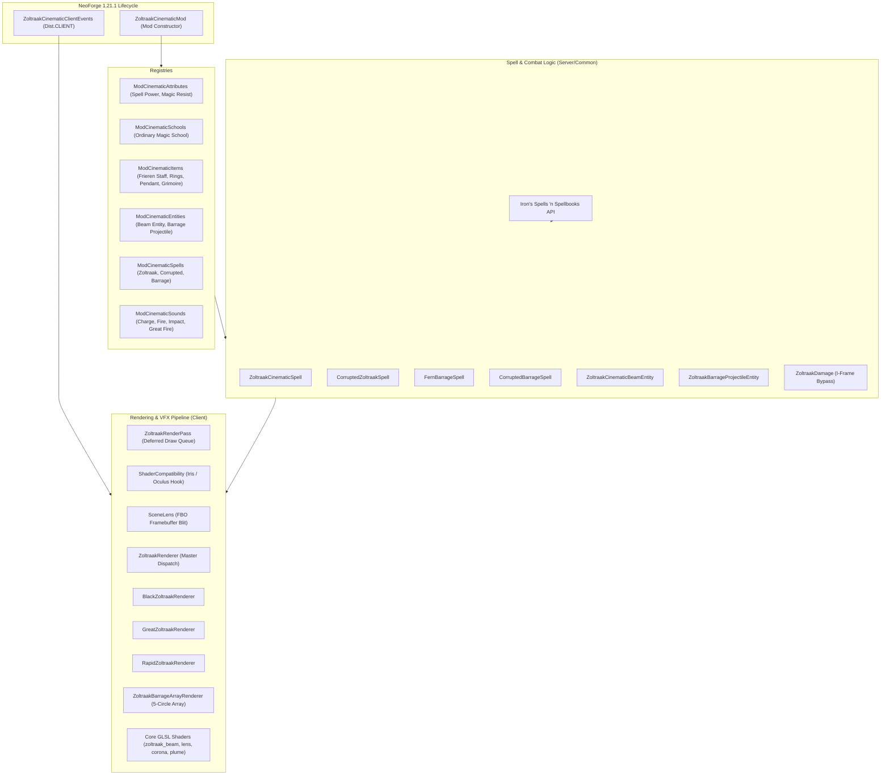
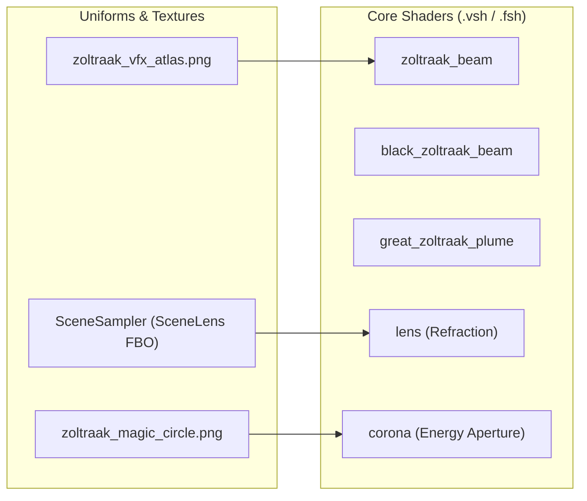

# Zoltraak: Cinematic Edition — Architecture & Technical Documentation
**Version:** 1.0.0 | **Minecraft:** 1.21.1 | **Mod Loader:** NeoForge 21.1.248+ | **Target API:** Iron's Spells 'n Spellbooks

---

## 1. Executive Summary & Vision

**Zoltraak: Cinematic Edition** is a visual and mechanical addon for *Iron's Spells 'n Spellbooks (ISS)* on Minecraft 1.21.1 (NeoForge). Its design goal is to deliver a 1:1 anime-accurate recreation of the iconic "Ordinary Offensive Magic" (*Zoltraak / ゾルトラーク*) from *Frieren: Beyond Journey's End* (*Sousou no Frieren*), achieving AAA-grade cinematic visual fidelity, screen-space dynamics, and balanced gameplay integration.

The mod achieves this through:
- **Zero-Black-Smoke Energy Ionization**: Pure photonic plasma and star dust aesthetics.
- **Multi-Circle Orbital Array**: 5 runic circles arranged in 3D local coordinate space for continuous rapid barrage.
- **Custom Core GLSL 150 Shaders**: Procedural ray rippling, FBM dark soot noise, gravitational lensing, and volumetric plumes.
- **Deferred Render Pass Architecture**: Overriding standard rendering via `AFTER_SKY` and `AFTER_LEVEL` passes for flicker-free translucent depth sorting.
- **Zero-Crash Decoupling & Shader Compatibility**: Dynamic reflection fallback and seamless compatibility with Iris / Oculus shader packs.

---

## 2. High-Level Architecture Diagram



---

## 3. Directory & Package Structure

```
zoltraak-cinematic/
├── build.py                                  # Standalone Python + JDK 21 build & auto-deployment pipeline
├── zoltraak_cinematic-neoforge-1.21.1-1.0.0.jar # Compiled mod artifact
├── libs/                                     # NeoForge and runtime dependency jars
├── reverse_engineering/                      # Source reference implementations (frierenvoid)
└── src/main/
    ├── java/com/frierenflight/zoltraakcinematic/
    │   ├── ZoltraakCinematicMod.java         # Mod entry point & creative tab registration
    │   ├── ZoltraakDamage.java               # I-Frame bypass & damage application utility
    │   ├── client/
    │   │   ├── ZoltraakCinematicClientEvents.java # Camera shake, flash overlay, tick listeners
    │   │   └── renderer/
    │   │       ├── IZoltraakVisualEntity.java    # Standardized visual interface
    │   │       ├── ZoltraakMode.java             # SINGLE, RAPID, LARGE definitions
    │   │       ├── ZoltraakColorTheme.java       # DEMON_SLAYING vs HUMAN_KILLING palettes
    │   │       ├── ZoltraakRenderPass.java       # Deferred rendering queue
    │   │       ├── ZoltraakRenderTypes.java      # Custom Blaze3D RenderTypes
    │   │       ├── ZoltraakCinematicShaders.java # ShaderInstance registration
    │   │       ├── ShaderCompatibility.java      # Iris/Oculus dynamic reflection API
    │   │       ├── SceneLens.java                # Off-screen scene capture for refraction
    │   │       ├── ZoltraakRenderer.java         # Primary Zoltraak beam renderer
    │   │       ├── BlackZoltraakRenderer.java    # Corrupted beam renderer
    │   │       ├── GreatZoltraakRenderer.java    # High-yield volumetric beam renderer
    │   │       ├── RapidZoltraakRenderer.java    # Barrage projectile renderer
    │   │       ├── ZoltraakBarrageArrayRenderer.java # 5-Circle orbital caster array
    │   │       ├── ZoltraakBarrageProjectileRenderer.java # EntityRenderer wrapper
    │   │       └── ZoltraakPhotonBeamRenderer.java     # EntityRenderer wrapper
    │   ├── entity/
    │   │   ├── ZoltraakCinematicBeamEntity.java  # Continuous piercing raycast entity
    │   │   └── ZoltraakBarrageProjectileEntity.java # High-speed projectile entity
    │   ├── item/
    │   │   ├── FrierenStaffItem.java             # 3D Staff with attribute modifiers
    │   │   ├── MirrorLotusRingItem.java          # Curios ring with CDR & spell power
    │   │   ├── ManaConcealmentPendantItem.java   # Curios necklace with resistance
    │   │   └── OrdinaryGrimoireItem.java         # 10-slot spellbook focus
    │   ├── registry/
    │   │   ├── ModCinematicAttributes.java       # Player custom attribute modifiers
    │   │   ├── ModCinematicEntities.java         # Beam & projectile entities
    │   │   ├── ModCinematicItems.java            # Mod items
    │   │   ├── ModCinematicSchools.java          # Ordinary Magic school
    │   │   ├── ModCinematicSounds.java           # Sound events
    │   │   └── ModCinematicSpells.java           # Spell definitions
    │   └── spell/
    │       ├── ZoltraakCinematicSpell.java       # Standard Frieren Zoltraak
    │       ├── CorruptedZoltraakSpell.java       # Qual Human-Killing Zoltraak
    │       ├── FernBarrageSpell.java             # Fern 10/s rapid barrage
    │       └── CorruptedBarrageSpell.java        # Dark barrage variant
    └── resources/
        ├── META-INF/neoforge.mods.toml           # NeoForge mod metadata
        ├── assets/zoltraak_cinematic/
        │   ├── lang/ (en_us.json, th_th.json)    # English and Thai localizations
        │   ├── models/item/                      # 3D item models
        │   ├── shaders/core/                     # GLSL 150 vertex & fragment shaders
        │   ├── textures/ (spell, entity, item)   # VFX atlases, runes, icons
        │   └── sounds.json & sounds/             # Custom sound assets
        └── data/ (curios, irons_spellbooks, zoltraak_cinematic) # Recipes, tags, school foci
```

---

## 4. Domain & Registry System

### 4.1 Magic School: Ordinary Magic (`ordinary_magic`)
- **Resource Location:** `zoltraak_cinematic:ordinary_magic`
- **Focus Tag:** `#zoltraak_cinematic:ordinary_magic_focus`
- **Color Theme:** Cyan (`#00E5FF`)
- **Key Attributes:**
  - `attribute.zoltraak_cinematic.zoltraak_spell_power`: Increases damage of all Ordinary Magic spells.
  - `attribute.zoltraak_cinematic.zoltraak_magic_resist`: Decreases incoming Ordinary Magic damage.

### 4.2 Spells Overview

| Spell ID | Class | Cast Type | Mana | Cooldown | Key Features |
| :--- | :--- | :--- | :--- | :--- | :--- |
| `zoltraak` | `ZoltraakCinematicSpell` | `INSTANT` | 40 (+6/lvl) | 4.0s | 64m piercing photonic beam, 12m terminal shockwave, shield breaking, crater carving. |
| `corrupted_zoltraak` | `CorruptedZoltraakSpell` | `INSTANT` | 48 (+7/lvl) | 4.5s | Dark void beam, armor bypass, inflicts Wither & Slowness, electric magenta flares. |
| `zoltraak_barrage` | `FernBarrageSpell` | `CONTINUOUS` (3s) | 22 (+3/lvl) | 1.0s | 10 shots/s across 5 floating magic circles, 56 m/s supersonic projectiles, micro-stagger. |
| `corrupted_barrage` | `CorruptedBarrageSpell` | `CONTINUOUS` (3s) | 28 (+4/lvl) | 1.2s | High-frequency dark thorn projectiles, dark decay, shield bypass. |

### 4.3 Custom Items & Equipment

1. **Frieren's Staff (`frieren_staff`)**:
   - Custom 3D voxel model with handcrafted display transforms.
   - **Modifiers (Mainhand):** +6.0 Attack Damage, +45% Spell Power, +35% Zoltraak Spell Power, +500 Max Mana, +20% Cooldown Reduction.
2. **Ring of the Mirror Lotus (`mirror_lotus_ring`)**:
   - Curios Ring slot item.
   - **Modifiers:** +25% Zoltraak Spell Power, +15% Cooldown Reduction, +150 Max Mana, +1.0 Mana Regen.
3. **Mana Concealment Pendant (`mana_concealment_pendant`)**:
   - Curios Necklace slot item.
   - **Modifiers:** +20% Zoltraak Magic Resistance, +10% Cast Time Reduction, +200 Max Mana.
4. **Grimoire of Ordinary Magic (`ordinary_grimoire`)**:
   - Elite 10-slot Spellbook focus item.
   - **Modifiers:** +30% Zoltraak Spell Power, +15% Universal Spell Power, +300 Max Mana, +15% Cooldown Reduction.

---

## 5. Entities & Combat Mathematics

### 5.1 `ZoltraakCinematicBeamEntity`
- **Lifetime:** 46 ticks (2.3s total; charge period: 14 ticks / 0.70s; discharge duration: 9 ticks).
- **Positioning & Staff Anchor:**
  While charging, real-time positional updates sync to the caster's staff anchor:
  $$\vec{P}_{anchor} = \vec{P}_{eye} + 0.32\hat{R} - 0.22\hat{Y} + 1.25\hat{D}$$
  *(where $\hat{R}$ is the view right vector and $\hat{D}$ is the look direction vector).*
- **Dynamic Raycast Piercing:**
  Calculates distance iteratively along the look vector up to 64 blocks, stopping only when encountering blocks with `destroySpeed > 1.5` (or $> 40.0$ in `LARGE` mode).
- **Terminal Blast & Falloff Damage:**
  Entities within the blast radius ($R=12.0\text{m}$, or $21.0\text{m}$ in large mode) receive distance-attenuated damage:
  $$\text{Damage}(d) = \max\left(12.0,\, \text{SpellDamage} \times \left(1.0 - \frac{d}{R}\right) \times \text{Multiplier}\right)$$
- **Shield Disabling:** Directly calls `Player#disableShield()` on blocking targets.
- **Crater Carving:** Governed by `GameRules.RULE_MOBGRIEFING`, clearing blocks within radius 4 ($R=7$ for large) excluding unbreakable blocks (Obsidian, Bedrock).

### 5.2 `ZoltraakBarrageProjectileEntity`
- **Velocity:** 56 m/s (`deltaMovement = 2.8` blocks/tick).
- **Path History Tracking:** Maintains an interpolation point list `pathHistory` allowing `RapidZoltraakRenderer` to construct smooth, curved ribbons behind moving projectiles.
- **I-Frame Bypass (`ZoltraakDamage`):**
  Temporarily clears `invulnerableTime = 0` during damage application and restores it safely in a `finally` block, ensuring every hit in a 10-shot-per-second stream registers reliably.

---

## 6. Client Rendering & Visual Architecture

### 6.1 Deferred Render Pass (`ZoltraakRenderPass`)
Minecraft's default entity rendering stage can cause depth-sorting artifacts with custom blended additive quads. `ZoltraakRenderPass` intercepts Zoltraak entity render calls:
1. `AFTER_SKY`: Resets queue (`begin()`).
2. `render()` calls from Minecraft: Caches model-view matrix, projection matrix, and entity state into `DRAWS`.
3. `AFTER_LEVEL`: Replays all stored draws (`finish()`) with `GL_LEQUAL` depth testing directly against the main render target FBO.

### 6.2 5-Circle Orbital Array (`ZoltraakBarrageArrayRenderer`)
When channeling `FernBarrageSpell`, 5 floating runic circles are rendered around the caster:
- **Center Circle:** Scale $0.55\text{m}$, offset $(0.0, -0.06, 1.45)$
- **Satellite 1 (Top-Left):** Scale $0.36\text{m}$, offset $(-0.68, 0.40, 1.25)$
- **Satellite 2 (Top-Right):** Scale $0.36\text{m}$, offset $(0.68, 0.40, 1.25)$
- **Satellite 3 (Bottom-Left):** Scale $0.34\text{m}$, offset $(-0.58, -0.36, 1.35)$
- **Satellite 4 (Bottom-Right):** Scale $0.34\text{m}$, offset $(0.58, -0.36, 1.35)$

Firing follows a staggered cycler pattern: `[1, 4, 0, 2, 3]`. Each discharge triggers an expanding shockwave ring (`muzzleTicks`) on the specific circle.

### 6.3 Core GLSL 150 Shaders



- **`zoltraak_beam.fsh`**: Renders high-frequency sine ripple along beam length $X$, calculates core taper, HDR core falloff, and soft cyan sheath.
- **`black_zoltraak_beam.fsh`**: Implements 2D Fractal Brownian Motion (FBM) noise, particulate cell discretization via screen derivative `fwidth`, and electric purple rim highlighting.
- **`lens.fsh`**: Takes `SceneSampler` from `SceneLens#capture()` and applies radial gravitational lensing displacement with chromatic offset (`lo`/`hi` clamped).
- **`great_zoltraak_plume.fsh`**: Renders volumetric high-yield mana plumes with noise-driven erosion.

### 6.4 Screen Dynamics & Camera Effects
- **Fire Shock Kickback (`ViewportEvent.ComputeCameraAngles`)**:
  - Initial upward pitch kick: $-2.8^\circ \times e^{-0.9t}$.
  - Multi-harmonic jitter: $\sin(26t)$ pitch, $\cos(21t)$ yaw, $\sin(16t)$ roll.
- **Barrage Micro-Rumble**: High-frequency vibration ($\sin(34t)$) while channeling barrage.
- **First-Person Exposure Flash (`RenderGuiEvent.Post`)**: Fullscreen blinding flash ($0xE8F8FF$) decaying over 3 ticks with chromatic cyan/violet screen borders.

---

## 7. Build & Deployment Architecture

The project features a dedicated Python orchestration script (`build.py`):
1. **Compilation**: Invokes JDK 21 `javac` directly against `libs/neoforge-21.1.248-client.jar`, `libs/neoforge-21.1.248-universal.jar`, and supporting libraries.
2. **Resource Merging**: Recursively mirrors `src/main/resources` into `build/classes`.
3. **Packaging**: Generates `zoltraak_cinematic-neoforge-1.21.1-1.0.0.jar`.
4. **Auto-Deployment**: Copies the built JAR automatically to:
   - Mod root and parent workspace folder.
   - CurseForge test instance: `C:\Users\vivo9\curseforge\minecraft\Instances\LING Horizons2.0test\mods`.

---

## 8. Summary of Mod Systems

| System | Primary Files | Role |
| :--- | :--- | :--- |
| **Mod Initialization** | `ZoltraakCinematicMod.java` | Coordinates event buses, registries, and creative tab entries. |
| **Registries** | `registry/ModCinematic*` | Declares spells, entities, items, sounds, attributes, and schools. |
| **Combat & Entities** | `entity/*`, `ZoltraakDamage.java` | Handles hitbox calculations, raycasts, I-frames, and damage. |
| **Spells** | `spell/*` | Implements ISS `AbstractSpell` lifecycles (cast times, animations, costs). |
| **Renderers** | `client/renderer/*` | Blaze3D tessellation, multi-circle arrays, and beam geometries. |
| **Render Pass** | `ZoltraakRenderPass.java`, `SceneLens.java` | Deferred rendering pass and screen-space distortion. |
| **Core Shaders** | `assets/.../shaders/core/*` | GLSL 150 procedural effects and noise algorithms. |
| **Client Events** | `ZoltraakCinematicClientEvents.java` | Handles screen kickback, rumble, and exposure flash overlays. |
