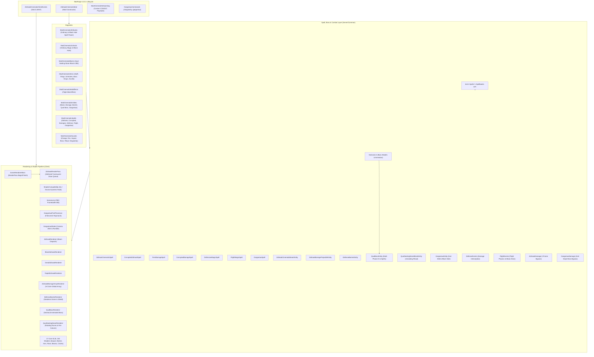
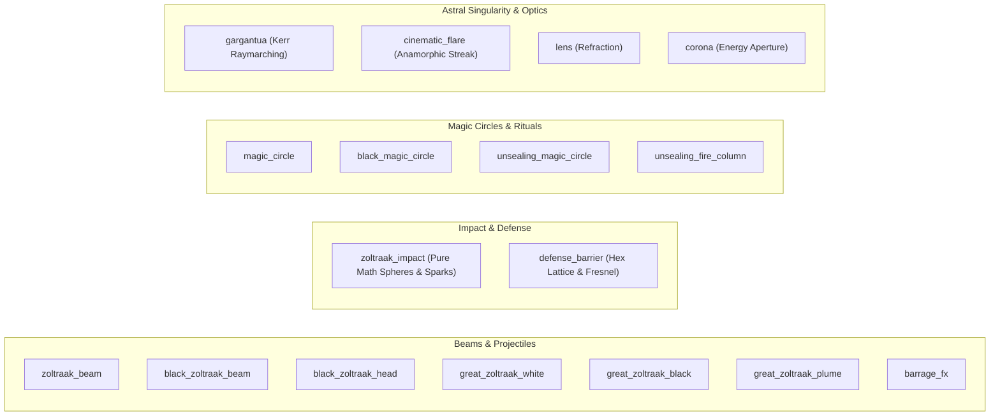

# Zoltraak: Cinematic Edition — Architecture & Technical Documentation
**Version:** 1.0.0 | **Minecraft:** 1.21.1 | **Mod Loader:** NeoForge 21.1.248+ | **Target API:** Iron's Spells 'n Spellbooks

---

## 1. Executive Summary & Vision

**Zoltraak: Cinematic Edition** is a visual and mechanical addon for *Iron's Spells 'n Spellbooks (ISS)* on Minecraft 1.21.1 (NeoForge). Its design goal is to deliver a 1:1 anime-accurate recreation of the iconic magic system from *Frieren: Beyond Journey's End* (*Sousou no Frieren*), featuring:
- **Ordinary Offensive Magic (*Zoltraak / ゾルトラーク*)**: Standard Holy Cyan and Corrupted Black beams, high-yield Great Zoltraak, and supersonic 5-circle rapid barrages.
- **Defensive Magic (*Defensive Barrier / 防御魔法*)**: Geodesic honeycomb domes and directional aegis shields with procedural hexagonal lattice resonance, chromatic dispersion Fresnel, and dielectric mana sparks.
- **Human Flight Magic (*Flight / 飛行魔法*)**: Smooth 3D omnidirectional soaring, aerodynamic camera roll, speed boost, hover, and dynamic stamina/mana drain.
- **The Elder Sage of Corruption: Qual (*腐敗の賢老 クヴァール*)**: Boss fight encounter summoned via the ancient sealing stone ritual, featuring multi-phase combat, barrier-flanking AI, and cataclysmic black magic.
- **Astral Singularity: Gargantua**: A general-relativistic rotating Kerr black hole spell with 4th-order geodesic raymarching, Doppler-beamed volumetric accretion disk, frame dragging, and cataclysmic supernova blast.

### Key Architectural Tenets:
- **Zero-Vanilla-Particle Ionization**: All vanilla sprite particles (`END_ROD`, `ELECTRIC_SPARK`, `SMOKE`) are completely eliminated in favor of pure procedural mathematical GLSL shaders (`zoltraak_impact.fsh`, `defense_barrier.fsh`, `barrage_fx.fsh`).
- **Multi-Circle Orbital Array**: 5 runic circles arranged in 3D local coordinate space for continuous rapid barrage with staggered firing cyclers.
- **Procedural Core GLSL 150 Shaders**: 17 custom shader programs handling Kerr raymarching, anamorphic flares, chromatic dispersion, volumetric plumes, and hexagonal lattice resonance.
- **Deferred Render Pass & Screen-Space Pipeline**: Intercepting `GameRenderer#renderLevel` via Mixin and NeoForge render stages for flicker-free translucent depth sorting, post-processor framebuffer blitting, and multi-octave camera dynamics.
- **Zero-Crash Decoupling & Shader Compatibility**: Dynamic reflection fallback and seamless compatibility with Iris / Oculus / Sodium shader packs.

---

## 2. High-Level Architecture Diagram



---

## 3. Directory & Package Structure

```
zoltraak-cinematic/
├── build.py                                  # Standalone Python + JDK 21 build & auto-deployment pipeline
├── zoltraak_cinematic-neoforge-1.21.1-1.0.0.jar # Compiled mod artifact
├── libs/                                     # NeoForge and runtime dependency jars
├── reverse_engineering/                      # Source reference implementations (frierenvoid)
└── src/main/
    ├── java/com/frierenflight/zoltraakcinematic/
    │   ├── ZoltraakCinematicMod.java         # Mod entry point, configuration & creative tab setup
    │   ├── ZoltraakDamage.java               # I-Frame bypass & damage application utility
    │   ├── block/
    │   │   ├── QualSealingStoneBlock.java    # Unsealing ritual block
    │   │   └── entity/
    │   │       └── QualSealingStoneBlockEntity.java # Ritual timer, sound, rune & fire animation
    │   ├── client/
    │   │   ├── QualClientHelper.java         # Client visual animation helpers for Qual boss
    │   │   ├── ZoltraakCinematicClientEvents.java # Keymappings, renderers, camera shake & flash
    │   │   ├── model/
    │   │   │   └── QualBossModel.java        # GeckoLib animated boss model
    │   │   └── renderer/
    │   │       ├── BlackZoltraakRenderer.java    # Corrupted beam renderer
    │   │       ├── DefenseBarrierRenderer.java   # Geodesic honeycomb dome & directional shield
    │   │       ├── GargantuaPostProcessor.java   # Fullscreen Kerr black hole raymarch post-processor
    │   │       ├── GargantuaRenderer.java        # Bounding box anchor & fallback renderer
    │   │       ├── GargantuaShake.java           # Multi-octave continuous & blast camera rumble
    │   │       ├── GeodesicDomeData.java         # 162-vertex 30-cell geodesic polyhedron math
    │   │       ├── GreatZoltraakRenderer.java    # Volumetric high-yield beam renderer
    │   │       ├── IZoltraakVisualEntity.java    # Standardized visual interface
    │   │       ├── QualBossRenderer.java         # GeckoLib boss renderer
    │   │       ├── QualSealingStoneRenderer.java # Unsealing rune circles & fiery column
    │   │       ├── RapidZoltraakRenderer.java    # Projectile renderer with procedural trails
    │   │       ├── SceneLens.java                # Off-screen scene capture for refraction
    │   │       ├── ShaderCompatibility.java      # Iris/Oculus dynamic reflection API
    │   │       ├── ZoltraakBarrageArrayRenderer.java # 5-Circle orbital caster array
    │   │       ├── ZoltraakBarrageProjectileRenderer.java # EntityRenderer wrapper
    │   │       ├── ZoltraakCinematicShaders.java # 17 Core ShaderInstance registrations
    │   │       ├── ZoltraakColorTheme.java       # DEMON_SLAYING vs HUMAN_KILLING palettes
    │   │       ├── ZoltraakMode.java             # SINGLE, RAPID, LARGE definitions
    │   │       ├── ZoltraakPhotonBeamRenderer.java # EntityRenderer wrapper
    │   │       ├── ZoltraakRenderer.java         # Primary Zoltraak beam renderer
    │   │       ├── ZoltraakRenderPass.java       # Deferred rendering queue
    │   │       └── ZoltraakRenderTypes.java      # Custom Blaze3D RenderTypes
    │   ├── command/
    │   │   └── GargantuaCommands.java        # /singularity, /gargantua commands
    │   ├── config/
    │   │   └── ZoltraakCinematicConfig.java  # Common config (Gargantua parameters & griefing safety)
    │   ├── effect/
    │   │   └── FlightMobEffect.java          # Omnidirectional 3D flight status effect
    │   ├── entity/
    │   │   ├── DefenseBarrierEntity.java     # Directional & dome defensive barrier entity
    │   │   ├── GargantuaDamage.java          # Damage source with boss anti-snipe bypass
    │   │   ├── GargantuaEntity.java          # Rotating Kerr black hole singularity entity
    │   │   ├── ZoltraakBarrageProjectileEntity.java # High-speed projectile entity
    │   │   ├── ZoltraakCinematicBeamEntity.java  # Continuous piercing raycast entity
    │   │   └── boss/
    │   │       ├── QualBossEntity.java       # Elder Sage of Corruption (GeckoLib Boss)
    │   │       └── ai/
    │   │           ├── QualAntiBarrierGoal.java   # Barrier detection & flanking teleport AI
    │   │           ├── QualCataclysmicGoal.java   # Apocalypse spell charging AI
    │   │           ├── QualCombatGoal.java        # Zoltraak barrage & beam combat AI
    │   │           └── QualFollowPlayerGoal.java  # Floating pursuit AI
    │   ├── event/
    │   │   ├── DefenseEvents.java            # Damage interception on active barriers
    │   │   └── FlightEvents.java             # 3D flight movement physics, camera roll & stamina
    │   ├── item/
    │   │   ├── CorruptionCoreItem.java       # Boss crafting ingredient
    │   │   ├── ElderSageGrimoireItem.java    # Qual corrupted spellbook focus
    │   │   ├── FrierenStaffItem.java         # 3D Staff with attribute modifiers
    │   │   ├── GargantuaScrollItem.java      # Legendary singularity spell scroll
    │   │   ├── HornOfCorruptionItem.java     # Boss trophy & crafting ingredient
    │   │   ├── ManaConcealmentPendantItem.java # Curios necklace with resistance
    │   │   ├── MirrorLotusRingItem.java      # Curios ring with CDR & spell power
    │   │   └── OrdinaryGrimoireItem.java     # 10-slot spellbook focus
    │   ├── mixin/
    │   │   └── GameRendererMixin.java        # Hooks into renderLevel for ZoltraakRenderPass
    │   ├── network/
    │   │   ├── DefenseCastPayload.java       # Quick defense barrier cast payload (Key X)
    │   │   ├── FlightTogglePayload.java      # Flight activation toggle payload (Key V)
    │   │   └── ModCinematicNetworking.java   # Packet registration & dispatch
    │   ├── registry/
    │   │   ├── ModCinematicAttributes.java   # Player attributes (Zoltraak, Black Hole Spell Power)
    │   │   ├── ModCinematicBlocks.java       # Qual Sealing Stone Block & Block Entity
    │   │   ├── ModCinematicEntities.java     # Beam, barrage, barrier, Qual boss, Gargantua
    │   │   ├── ModCinematicItems.java        # Items, weapons, curio rings, grimoires, scrolls
    │   │   ├── ModCinematicMobEffects.java   # Flight mob effect
    │   │   ├── ModCinematicSchools.java      # Ordinary Magic & Black Hole Magic schools
    │   │   ├── ModCinematicSounds.java       # Custom acoustic events (Charge, fire, boss, singularity)
    │   │   └── ModCinematicSpells.java       # All 7 spell definitions
    │   └── spell/
    │       ├── CorruptedBarrageSpell.java    # Dark continuous rapid barrage
    │       ├── CorruptedZoltraakSpell.java   # Qual Human-Killing Zoltraak beam
    │       ├── DefensiveMagicSpell.java      # Directional shield & geodesic honeycomb dome
    │       ├── FernBarrageSpell.java         # Fern 10/s rapid barrage with 5-circle orbital array
    │       ├── FlightMagicSpell.java         # Instant toggle omnidirectional flight
    │       ├── GargantuaSpell.java           # Astral Singularity: Gargantua
    │       └── ZoltraakCinematicSpell.java   # Standard Frieren Zoltraak beam
    └── resources/
        ├── META-INF/neoforge.mods.toml       # NeoForge mod metadata
        ├── zoltraak_cinematic.mixins.json    # Mixin configuration for GameRenderer
        ├── assets/zoltraak_cinematic/
        │   ├── lang/ (en_us.json, th_th.json) # Localizations
        │   ├── models/ (block/, item/)       # 3D block and item models
        │   ├── shaders/core/                 # 17 GLSL 150 vertex & fragment shaders (.json, .vsh, .fsh)
        │   ├── textures/ (block/, effect/, entity/, gui/, item/, mob_effect/, spell/)
        │   └── sounds.json & sounds/         # High-fidelity custom sound effects
        └── data/
            ├── c/tags/damage_type/           # Common tags (#c:is_magic)
            ├── curios/tags/item/             # Curios slot tags (necklace, ring, spellbook)
            ├── irons_spellbooks/tags/item/   # School focus tags
            ├── minecraft/tags/damage_type/   # Minecraft tags (bypasses_armor, bypasses_shield, etc.)
            ├── neoforge/tags/damage_type/    # NeoForge tags (#neoforge:is_magic)
            └── zoltraak_cinematic/           # Recipes, damage types, school foci tags
```

---

## 4. Domain & Registry System

### 4.1 Magic Schools

#### 4.1.1 Ordinary Magic (`ordinary_magic`)
- **Resource Location:** `zoltraak_cinematic:ordinary_magic`
- **Focus Tag:** `#zoltraak_cinematic:ordinary_magic_focus`
- **Color Theme:** Cyan (`#00E5FF`)
- **Key Attributes:**
  - `attribute.zoltraak_cinematic.zoltraak_spell_power`: Increases damage of all Ordinary Magic spells (Beams, Barrages, Defense Capacity).
  - `attribute.zoltraak_cinematic.zoltraak_magic_resist`: Decreases incoming Ordinary Magic damage.

#### 4.1.2 Black Hole Magic (`black_hole`)
- **Resource Location:** `zoltraak_cinematic:black_hole`
- **Focus Tag:** `#zoltraak_cinematic:black_hole_focus`
- **Color Theme:** Deep Cosmic Violet (`#1A0B2E` / `#8A2BE2`)
- **Key Attributes:**
  - `attribute.zoltraak_cinematic.black_hole_spell_power`: Multiplies the supernova blast and continuous tidal/plasma accretion damage.
  - `attribute.zoltraak_cinematic.black_hole_magic_resist`: Decreases incoming Black Hole and gravitational shear damage.

---

### 4.2 Complete Spells Overview

| Spell ID | Class | Cast Type | Mana Cost | Cooldown | Key Features |
| :--- | :--- | :--- | :--- | :--- | :--- |
| `zoltraak` | `ZoltraakCinematicSpell` | `INSTANT` | 40 (+6/lvl) | 4.0s | 64m piercing photonic beam, 12m terminal blast, shield breaking, crater carving. |
| `corrupted_zoltraak` | `CorruptedZoltraakSpell` | `INSTANT` | 48 (+7/lvl) | 4.5s | Dark void beam, armor bypass, inflicts Wither & Slowness, electric magenta flares. |
| `zoltraak_barrage` | `FernBarrageSpell` | `CONTINUOUS` (3s) | 22 (+3/lvl) | 1.0s | 10 shots/s across 5-circle orbital array, 56 m/s supersonic projectiles, micro-stagger. |
| `corrupted_barrage` | `CorruptedBarrageSpell` | `CONTINUOUS` (3s) | 28 (+4/lvl) | 1.2s | High-frequency dark thorn projectiles, dark decay, shield bypass. |
| `defense` | `DefensiveMagicSpell` | `INSTANT` | 200 (+10/lvl) | 10.0s | Dual-mode barrier: Directional Aegis (standing) & Geodesic Dome (crouching), damage absorption, projectile interception. |
| `flight` | `FlightMagicSpell` | `INSTANT` (Toggle) | 25 (drain 50→40/s) | 1.0s | Omnidirectional 3D soaring, aerodynamic roll, speed boost, altitude stamina scaling. |
| `gargantua` | `GargantuaSpell` | `LONG` (4.0s) | 2,500 | 600.0s | Astral Singularity: Kerr black hole, 100m pull field, 0–32m accretion disk damage, zero item deletion, boss anti-snipe immunity, supernova blast. |

---

### 4.3 Custom Items, Equipment & Crafting Recipes

1. **Frieren's Staff (`frieren_staff`)**:
   - 3D voxel model with handcrafted third-person and first-person display transforms.
   - **Modifiers (Mainhand):** +6.0 Attack Damage, +45% Spell Power, +35% Zoltraak Spell Power, +500 Max Mana, +20% Cooldown Reduction.
   - **Recipe:** Gold Ingot + Netherite Ingot + Crying Obsidian + Sticks + Amethyst Shards.
2. **Ring of the Mirror Lotus (`mirror_lotus_ring`)**:
   - Curios Ring slot item.
   - **Modifiers:** +25% Zoltraak Spell Power, +15% Cooldown Reduction, +150 Max Mana, +1.0 Mana Regen.
   - **Recipe:** Diamond + Amethyst Shards + Gold Ingots.
3. **Mana Concealment Pendant (`mana_concealment_pendant`)**:
   - Curios Necklace slot item.
   - **Modifiers:** +20% Zoltraak Magic Resistance, +10% Cast Time Reduction, +200 Max Mana.
   - **Recipe:** Echo Shard + Gold Ingots + String.
4. **Grimoire of Ordinary Magic (`ordinary_grimoire`)**:
   - Elite 10-slot Spellbook focus item.
   - **Modifiers:** +30% Zoltraak Spell Power, +15% Universal Spell Power, +300 Max Mana, +15% Cooldown Reduction.
   - **Recipe:** Netherstite Scrap + Arcane Essence + Book + Amethyst Shards.
5. **Elder Sage's Grimoire (`elder_sage_grimoire`)**:
   - Corrupted 10-slot Spellbook focus item (Qual's legacy).
   - **Modifiers:** +35% Corrupted Magic Spell Power, +20% Universal Spell Power, +400 Max Mana, +15% Cooldown Reduction.
   - **Recipe:** `ordinary_grimoire` + 4x `horn_of_corruption` + `corruption_core` + `netherite_ingot`.
6. **Horn of Corruption (`horn_of_corruption`)**:
   - Rare boss trophy and crafting material dropped exclusively by defeating Qual.
7. **Corruption Core (`corruption_core`)**:
   - Concentrated condensed mana core dropped by defeating Qual.
8. **Qual Sealing Stone (`qual_sealing_stone`)**:
   - Ritual catalyst block item. Placing and interacting begins the unsealing ritual to awaken Qual.
   - **Recipe:** Nether Star + Crying Obsidian + Amethyst Shards + Deepslate.
9. **Qual Spawn Egg (`qual_spawn_egg`)**:
   - Creative spawn egg for `QualBossEntity`.
10. **Astral Singularity Scroll (`gargantua_scroll`)**:
    - Legendary spell scroll for learning the `gargantua` spell.
    - **Recipe:** Ender Dragon Egg (`minecraft:dragon_egg`) + 4x Ender Rune (`irons_spellbooks:ender_rune`) + 2x Arcane Essence + Legendary Ink + Paper.

---

### 4.4 Human Flight Mechanics (`FlightMobEffect` & `FlightEvents`)

- **Activation:** Renders a magic initiation sound and applies `ModCinematicMobEffects.FLIGHT`. Can be toggled on/off instantly via the `V` key (`KEY_FLIGHT`).
- **Movement Physics:**
  - Omnidirectional look-vector propulsion. Pressing forward accelerates along the look vector including vertical pitch.
  - Sprinting grants high-speed supersonic flight with subtle FOV inflation.
  - Releasing movement keys smoothly dampens inertia, transitioning into stationary mid-air hover.
- **Mana Drain Dynamics:**
  - Base drain of $50\text{ mana/s}$ (reduced by $-2.5\text{ mana/s}$ per spell level down to $40\text{ mana/s}$ at Level 5).
  - High-altitude scaling: flying above $Y=160$ increases mana consumption logarithmically, requiring tactical descent.
- **Client Dynamics:**
  - Camera rolls dynamically into turns ($\pm 6.5^\circ$ bank angle) based on mouse yaw delta for authentic aerodynamic feel.

---

## 5. Entities, Boss System & Combat Mathematics

### 5.1 `ZoltraakCinematicBeamEntity`
- **Lifetime:** 46 ticks (2.3s total; charge: 14 ticks; discharge: 9 ticks; dissipation: 23 ticks).
- **Staff Anchor Tracking:** Positional sync:
  $$\vec{P}_{anchor} = \vec{P}_{eye} + 0.32\hat{R} - 0.22\hat{Y} + 1.25\hat{D}$$
- **Raycast Piercing:** Penetrates iteratively along look vector up to 64 blocks, stopping only on hard blocks (`destroySpeed > 1.5` or $> 40.0$ in `LARGE` mode).
- **Terminal Shockwave Damage:**
  $$\text{Damage}(d) = \max\left(12.0,\, \text{SpellDamage} \times \left(1.0 - \frac{d}{R}\right) \times \text{Multiplier}\right)$$
- **Zero-Vanilla-Particles:** Impact uses `ZoltraakRenderTypes.ZOL_IMPACT` (procedural 3D relativistic mana sphere and dielectric sparks) with zero vanilla particle calls.

### 5.2 `ZoltraakBarrageProjectileEntity`
- **Velocity:** 56 m/s (`deltaMovement = 2.8` blocks/tick).
- **Path History Tracking:** Maintains an interpolation point list `pathHistory` allowing `RapidZoltraakRenderer` to construct smooth, curved ribbons behind moving projectiles.
- **I-Frame Bypass (`ZoltraakDamage`):**
  Temporarily clears `invulnerableTime = 0` during damage application and restores it safely in a `finally` block, ensuring every hit in a 10-shot-per-second stream registers reliably.
- **Zero-Vanilla-Particles:** In-flight trail and terminal shatter utilize procedural math shaders (`barrage_fx.fsh` and `zoltraak_impact.fsh`).

### 5.3 `DefenseBarrierEntity` (Defensive Magic Barrier)
- **Two Operating Modes:**
  - **Mode 0 (Directional Aegis Shield):** Forward-facing hexagonal shield adhering to caster's view direction. Radius $2.8\text{m}$.
  - **Mode 1 (Hemispherical Geodesic Dome):** Activated by crouching during cast. Full $360^\circ$ geodesic dome encompassing caster and allies. Radius $3.2\text{m}$.
- **Tessellation Geometry (`GeodesicDomeData`):**
  Calculates a 3D geodesic polyhedron consisting of 162 normalized vertices grouped into 30 hexagonal and pentagonal cells with chamfered 3D beveled facets.
- **Damage Interception (`DefenseEvents`):**
  Intercepts incoming player damage via `LivingIncomingDamageEvent` and performs ray-plane / ray-sphere intersection testing. Absorbs damage from the barrier's capacity pool before it reaches the player.
- **Projectile Deflection:** Intercepts arrows, magic projectiles, and barrage missiles in real-time. Projectiles reaching the barrier boundary are absorbed and discarded.
- **Visual Feedback:**
  - **Hit Deflection:** Generates a camera-facing mathematical 3D relativistic mana deflection flash via `ZoltraakRenderTypes.ZOL_IMPACT`.
  - **Catastrophic Rupture:** Depleted barrier shatters with a high-energy expanding relativistic mana burst (`ZOL_IMPACT`), illuminating flying hexagonal fragments without vanilla particles.

### 5.4 `QualBossEntity` (Elder Sage of Corruption - Qual Boss)
- **Attributes:** High base HP ($350$ to $650+$ scaling with world difficulty), flight navigation, immune to fire, high magic resistance.
- **Custom AI Subsystems:**
  - `QualCombatGoal`: Alternates between rapid Corrupted Barrage bursts and charged Corrupted Zoltraak beams.
  - `QualAntiBarrierGoal`: Actively detects player's active `DefenseBarrierEntity`. Computes the barrier normal vector and instantly shadow-teleports behind or above the player to bypass frontal defense.
  - `QualCataclysmicGoal`: Ultimate phase spell charging. Floats into the air, summons black void runes, and discharges an apocalyptic shockwave.
  - `QualFollowPlayerGoal`: Dynamic flying distance keeping ($12\text{m}$ to $22\text{m}$ combat spacing).
- **Phased Combat & GeckoLib Animations:**
  - Distinct animation states: Idle, Fly, Charge Zoltraak, Fire Beam, Rapid Barrage, and Cataclysmic Channeling.
  - Dynamic boss sound effects: `QUAL_SPAWN`, `QUAL_AMBIENT`, `QUAL_HURT`, `QUAL_DEATH`, `QUAL_PHASE_TRANSITION`, `QUAL_CATACLYSMIC_CHARGE`, `QUAL_TELEPORT`.

### 5.5 `QualSealingStoneBlockEntity` (Unsealing Ritual)
- Right-clicking the `QualSealingStoneBlock` begins a 200-tick (10s) unsealing ritual.
- Renders concentric rotating runic circles (`unsealing_magic_circle.fsh`), escalating fire pillar eruption (`unsealing_fire_column.fsh`), screen rumble, and ceremonial chime audio.
- Upon completion, the stone shatters and awakens `QualBossEntity` with a dramatic cinematic burst.

### 5.6 `GargantuaEntity` (Astral Singularity / Supermassive Kerr Metric)

`GargantuaEntity` manifests a supermassive rotating Kerr black hole with general relativistic gravitational lensing, volumetric gaseous accretion disk, dual photon rings, surface terrain tearing, frame-dragging acceleration, and cataclysmic supernova implosion/detonation.

#### 5.6.1 Physical & Metric Constants (Kerr Geometry)
- **Gravitational Radius ($r_g$):** $4.0\text{m}$ (`GRAVITATIONAL_RADIUS`).
- **Dimensionless Kerr Spin Parameter ($a/M$):** $0.60$ (`SPIN`).
- **Event Horizon Radius ($r_h$):** $1.8 r_g = 7.2\text{m}$ (`HORIZON_RADIUS`) — The spherical boundary of no return. Debris and projectiles crossing $r_h$ are swallowed and discarded.
- **Apparent Shadow Radius ($r_{\text{shadow}}$):** $\sqrt{27}\,r_g \approx 5.196 r_g = 20.784\text{m}$ (`SHADOW_RADIUS`) — The apparent optical photon capture boundary perceived by asymptotic observers (gravitational magnification factor $\approx 2.6\times$ relative to $r_h$).
- **Innermost Stable Circular Orbit ($r_{\text{isco}}$):** $3.83 r_g = 15.32\text{m}$ (`DISK_INNER_RADIUS`) — The inner boundary of the accretion disk.
- **Accretion Disk Outer Radius:** $13.5 r_g = 54.0\text{m}$ (`DISK_OUTER_RADIUS`), with shader volumetric span extending up to $22.5 r_g = 90.0\text{m}$.
- **Spherical Attraction Pull Radius ($R_{\text{pull}}$):** $100.0\text{m}$ (`PULL_RADIUS`, configurable `10.0`–`300.0`).
- **Supernova Blast Radius ($R_{\text{blast}}$):** $32.0\text{m}$ (`BLAST_RADIUS`, configurable `5.0`–`200.0`).
- **Continuous Accretion Damage Zone ($R_{\text{disk}}$):** $32.0\text{m}$ across the entire inner accretion vortex.

#### 5.6.2 Full 60-Second Life Cycle (1,200 Ticks Timeline)
The singularity executes an exact 1,200-tick (60.0s) timeline:

| Timeline Phase | Tick Range | Time (s) | Core Dynamics & Audio/Visual Events |
| :--- | :--- | :--- | :--- |
| **1. Spacetime Rupture** | $0 \le t \le 60$ | $0.0\text{s} - 3.0\text{s}$ | **Tick 1 Audio:** `ModCinematicSounds.SINGULARITY_CHARGE` (Vol 4.0, Pitch 0.95).<br>Core expands from $0.15 r_g$ ($0.6\text{m}$) to $4.0 r_g$ ($16.0\text{m}$) via $r_g(t) = 0.15 + (4.0 - 0.15)\,\text{smoothstep}(t / 60)$.<br>Rupture camera jolt: $\sin(t\pi / 60) \times 2.8 \times (1 - d / 80)$ within 80m. |
| **2. Active Accretion Vortex** | $60 < t \le 1060$ | $3.0\text{s} - 53.0\text{s}$ | **Periodic Audio:** `ModCinematicSounds.SINGULARITY_ACTIVE` played every 40 ticks.<br>Continuous camera rumble $(0.20 + 3.8\,\text{crit}^2) \times (1 - d/80)$.<br>Surface terrain tearing every 4 ticks (capped at 180 blocks).<br>Relativistic inward pull ($100\text{m}$) + frame-dragging swirl.<br>Dual-zone damage applied every 8 ticks ($0.4\text{s}$). |
| **3. Gravitational Implosion** | $1060 < t \le 1100$ | $53.0\text{s} - 55.0\text{s}$ | **Criticality:** $\text{crit}(t) = \text{smoothstep}((t - 1060) / 40) \in [0.0, 1.0]$.<br>Core compresses inward: $r_g(t) = 4.0 - 2.2\,\text{crit}(t)$ ($4.0\text{m} \to 1.8\text{m}$).<br>Brightness surges: $\text{brightness}(t) = 1.0 + 3.0\,\text{crit}(t)$ ($1.0 \to 4.0$).<br>Camera vibration escalates quadratically with $\text{crit}^2$. Disk emission boosted $1.8\times$. |
| **4. Supernova Detonation** | $t = 1100$ | $55.0\text{s}$ | **Audio Detonation:** `ModCinematicSounds.SINGULARITY_EXPLODE` (Vol 8.0) + `ModCinematicSounds.TINNITUS` (Vol 5.0).<br>Blinding screen flash for 45 ticks (`triggerFlash(45, 1.0f)`).<br>Massive shockwave camera shake: Strength 18.0 across 128m decaying over 55 ticks via $18.0 \times (1 - t_{\text{elapsed}}/55)^2 \times (1 - d/128)$.<br>Core expands: $1.8\text{m} \to 8.8\text{m}$. Swirling debris vaporized. |
| **5. Pristine World Restoration** | $1108 \le t \le 1200$ | $55.4\text{s} - 60.0\text{s}$ | **Pristine Reconstruction:** Restores all `tornBlocks` bottom-up ($Y$ ascending) with `BlockParticleOption` bursts in dynamic batches: $\text{batch} = \max(3, \lceil 2|\text{torn}| / (1200 - t) \rceil)$.<br>Spacetime heals: $\text{opened}(t) \to 0.0$ between ticks 1115 and 1200.<br>Tick 1200: Entity `discard()`. |

#### 5.6.3 Physical Inward Gravity & Item Safety Mechanics
- **Inward Acceleration Field ($d > 7.2\text{m}$):**
  $$\text{Strength} = a_{\text{base}} \times \left(1.0 + \frac{R_{\text{pull}} - d}{R_{\text{pull}}} \times 3.5\right) \quad (a_{\text{base}} = 0.12)$$
  $$\vec{v}_{k+1} = \vec{v}_k \times 0.92 + \hat{r}_{\text{inward}} \times \text{Strength}$$
- **Projectiles:** Inward acceleration multiplied by $2.5\times$; entering $r_h \implies$ swallowed and destroyed (`e.discard()`).
- **Swirling Debris (`FallingBlockEntity`):** Tangential swirl velocity based on spin axis $\hat{\omega}$:
  $$\hat{t} = \frac{\hat{\omega} \times \hat{r}_{\text{inward}}}{\|\hat{\omega} \times \hat{r}_{\text{inward}}\|}, \quad p = \text{clamp}\left(\frac{100 - d}{100 - 7.2}, 0, 1\right)$$
  $$\vec{v}_{\text{target}} = \hat{r}_{\text{inward}}\,(0.25 + 0.55\,p) + \hat{t}\,(0.40 + 0.85\,p) + \hat{y}\,\text{clamp}((Y_{\text{center}} - Y) \times 0.12, -0.4, 0.4)$$
- **Zero Item Deletion Guarantee:** `ItemEntity` instances are **strictly never swallowed or destroyed**. Inside the horizon, their velocity is dampened ($\vec{v} \times 0.85$), ensuring all player items and dropped loot remain 100% safe to pick up.

#### 5.6.4 Dual-Zone Damage & Boss Anti-Snipe Bypass
- **Damage Type:** `zoltraak_cinematic:gargantua` (`DamageSource` tagged `#is_magic`, `#bypasses_armor`, `#bypasses_shield`, `#always_hurts_ender_dragons`, `#bypasses_wolf_armor`).
- **Bounding Box Distance:** Measured directly to the nearest point on target bounding box $d_{\text{box}} = \sqrt{\text{distanceToSqr}(\text{center})}$, eliminating false penalties for giant bosses.
- **Accretion Vortex Damage (Every 8 ticks / 0.4s within $d_{\text{box}} \le 32.0\text{m}$):**
  - **Zone 1: Event Horizon Core ($d_{\text{box}} \le 7.2\text{m}$):**
    $$\text{Damage}_{\text{horizon}} = \max\left(35.0,\, \text{MaxHP} \times \text{tidalPct}\right) \quad (\text{tidalPct default} = 20\%)$$
  - **Zone 2: Accretion Disk Plasma Shear ($7.2\text{m} < d_{\text{box}} \le 32.0\text{m}$):**
    $$\text{Factor}_{\text{plasma}} = 0.30 + 0.70 \times \left(\frac{32.0 - d_{\text{box}}}{32.0 - 7.2}\right)$$
    $$\text{Damage}_{\text{plasma}} = \max\left(20.0,\, \text{MaxHP} \times (\text{tidalPct} \times \text{Factor}_{\text{plasma}})\right)$$
- **Boss Anti-Snipe Immunity Architecture:**
  Modded bosses (such as Cataclysm or Twilight Forest) often enforce out-of-range immunity if the damaging entity is far away ($>32\text{m}$). Gargantua completely bypasses this:
  - If the target is a Monster/Boss, `damageCauser` is set directly to `GargantuaEntity` itself (physically situated right next to the boss, $d_{\text{box}} \le 32\text{m}$).
  - Full player credit, kill advancement, and XP drops are preserved by invoking `targetLiving.setLastHurtByPlayer(player)`.
  - For PvP (target is `Player`), `damageCauser` is set to the caster for proper death messages.
- **Supernova Detonation Blast Damage (Tick 1100, $d \le 32.0\text{m}$):**
  $$\text{BaseDamage} = \left(\text{ConfigBlastDamage} \times \max\left(0.1,\, \frac{\text{SpellPower}}{500.0}\right)\right) + \min(\text{swallowedCount} \times 10.0,\, 200.0)$$
  $$\text{Falloff} = \max\left(0.25,\, 1.0 - \frac{d}{32.0}\right), \quad \text{FinalDamage} = \text{BaseDamage} \times \text{Falloff}$$
  Radial knockback impulse: $\vec{v}_{\text{impulse}} = \hat{r}_{\text{outward}} \times (3.2 \times \text{Falloff})$.

#### 5.6.5 Pristine World Auto-Reconstruction Engine
- **Terrain Tearing Envelope (`tearSurfaceBlocks`):**
  Tears blocks within $2.5\text{m} \le r \le 18.0\text{m}$ every 4 ticks, capped at 180 blocks maximum to maintain 20.0 TPS. Crater depth is parabolically bounded: $\text{maxDepth} = \max(1.0, 4.0 \times (1 - (r/18)^2))$.
- **Reconstruction Mechanics (`reconstructBlocks`):**
  Between ticks 1108 and 1200, all records in `tornBlocks` are sorted bottom-up ($Y$ ascending) and restored in batches with block particle effects.
- **Emergency Cleanup Safety (`remove()`):**
  If `GargantuaEntity` is terminated prematurely by `/kill` or chunk unload, `restoreAllRemainingBlocks()` executes synchronously, ensuring terrain is never left permanently cratered.

#### 5.6.6 Client-Side Relativistic Geodesic Raymarching (`gargantua.fsh` & `GargantuaPostProcessor`)
- **Pipeline Stage:** Hooked into `RenderLevelStageEvent.Stage.AFTER_LEVEL` with dual-buffered FBO ping-ponging (`sceneCopy` $\to$ `postTarget` $\to$ `activeDrawFbo`) to prevent OpenGL sampling feedback loops.
- **Thorne Geodesic Leapfrog Integration:**
  Directly solves the photon orbit equation:
  $$\frac{d^2 u}{d\phi^2} + u = 3M u^2 \quad \left(u = \frac{1}{r}\right)$$
  Integrated along ray direction with adaptive step budget (48 to 112 steps):
  $$\vec{d}_{k+1} = \text{normalize}\left(\vec{d}_k + \left(-1.5 h^2 \frac{\vec{p}_{k+1}}{\|\vec{p}_{k+1}\|^5}\right) \Delta t\right)$$
- **Volumetric Gaseous Accretion Disk:**
  Modulates local **thickness** (not brightness!) across 3 noise octaves, producing realistic turbulent wispy gas filaments ($h_{\text{inner}} = 0.38 r_g \to h_{\text{outer}} = 0.20 r_g$).
  Blackbody color grading `gargDiskColour(t)`: Pale White-Yellow $\to$ Radiant Champagne Gold $\to$ Glowing Amber $\to$ Deep Bronze-Orange.
- **Dual Photon Rings:**
  Primary exponential ring at shadow boundary + secondary higher-order loop ring ($1/535$ intensity).
- **Celestial Background & Depth Occlusion:**
  - `gargCosmicSky`: 3-tap noise interstellar nebula (indigo, violet, gold) + procedural diamond starfield with twinkling spectral giants.
  - Minecraft Depth Buffer sampling: Unprojects `DepthSampler` against eye-space depth, cleanly occluding the black hole behind terrain, blocks, and structures.
- **Supernova 5-Layer Detonation Shader VFX:**
  Incandescent expanding core fireball ($1.2 r_g \to 7.7 r_g$), 3D relativistic chromatic shockwave shell (cyan leading front, gold body, violet trailing wake), harmonic echo compression wave, piercing starburst godrays, and proximity cosmic ray flash.

#### 5.6.7 Endgame Itemization, Spells & Configuration
- **`GargantuaSpell` (`zoltraak_cinematic:gargantua`):** Legendary Tier Black Hole spell (`AbstractSpell`), Mana Cost: 3000, Cast Time: 80 ticks (4.0s), Cooldown: 600s (10 min), Base Power: 500. Spawns singularity 14m above ground raycast target (up to 48m reach).
- **`GargantuaScrollItem` (`zoltraak_cinematic:gargantua_scroll`):** Epic rarity, fire resistant, stacks to 16. Auto-binds to spell container for casting or inscription into legendary spellbooks.
- **`GargantuaCommands`:** Admin/Creative commands `/singularity`, `/zoltraak singularity`, `/gargantua`, `/zoltraak gargantua` (Permission level 2).
- **Config Options (`ZoltraakCinematicConfig`):**
  - `pullRadius` ($100.0\text{m}$, range $10.0$–$300.0$)
  - `tidalDamagePercent` ($0.20$, range $0.01$–$1.0$)
  - `blastDamage` ($800.0$, range $10.0$–$10000.0$)
  - `blastRadius` ($32.0\text{m}$, range $5.0$–$200.0$)
  - `pullAcceleration` ($0.12$, range $0.01$–$2.0$)
  - `autoReconstructBlocks` (`true`): Pristine World Auto-Reconstruction.
  - `tearBlocks` (`true`): Enables physical block tearing.
  - `respectMobGriefing` (`true`): Respects vanilla `mobGriefing` gamerule.

---

## 6. Client Rendering & Visual Architecture

### 6.1 Deferred Render Pass (`ZoltraakRenderPass` & `GameRendererMixin`)
Minecraft's default entity rendering can cause translucent sorting glitches.
1. `GameRendererMixin` intercepts `GameRenderer#renderLevel`:
   - `@At("HEAD")` invokes `ZoltraakRenderPass.begin()` to reset the draw queue.
   - `@At(value = "INVOKE", target = "...LevelRenderer;renderLevel...", shift = AFTER)` invokes `ZoltraakRenderPass.finish()`.
2. All Zoltraak entities record their draw calls into `DRAWS` and replay them in a dedicated depth-tested pass directly against the main FBO.

### 6.2 5-Circle Orbital Array (`ZoltraakBarrageArrayRenderer`)
When channeling `FernBarrageSpell`, 5 floating runic circles are rendered around the caster:
- **Center Circle:** Scale $0.55\text{m}$, offset $(0.0, -0.06, 1.45)$
- **Satellite 1 (Top-Left):** Scale $0.36\text{m}$, offset $(-0.68, 0.40, 1.25)$
- **Satellite 2 (Top-Right):** Scale $0.36\text{m}$, offset $(0.68, 0.40, 1.25)$
- **Satellite 3 (Bottom-Left):** Scale $0.34\text{m}$, offset $(-0.58, -0.36, 1.35)$
- **Satellite 4 (Bottom-Right):** Scale $0.34\text{m}$, offset $(0.58, -0.36, 1.35)$

Firing follows a staggered cycler pattern: `[1, 4, 0, 2, 3]`. Each discharge triggers an expanding shockwave ring (`muzzleTicks`) on the specific circle.

### 6.3 Complete 17 Core GLSL 150 Shaders (`ZoltraakCinematicShaders`)



| Shader Name | Format | Primary Role |
| :--- | :--- | :--- |
| **`zoltraak_beam`** | `POSITION_TEX_COLOR` | Photonic beam core, high-frequency sine ripple, HDR core falloff. |
| **`black_zoltraak_beam`** | `POSITION_TEX_COLOR` | 2D FBM noise, particulate cell discretization via screen derivative `fwidth`. |
| **`black_zoltraak_head`** | `POSITION_TEX_COLOR` | High-energy leading tip geometry for corrupted black beams. |
| **`great_zoltraak_white`** | `POSITION_TEX_COLOR` | High-yield wide photonic beam with multi-octave core pulsation. |
| **`great_zoltraak_black`** | `POSITION_TEX_COLOR` | Cataclysmic void beam with turbulent dark mana filaments. |
| **`great_zoltraak_plume`** | `POSITION_TEX_COLOR` | Volumetric high-yield mana plumes with noise-driven erosion. |
| **`barrage_fx`** | `POSITION_TEX_COLOR` | Supersonic projectile trail ribbons, dynamic speed stretching. |
| **`magic_circle`** | `POSITION_TEX_COLOR` | Holographic concentric rotating rune circles with procedural glow. |
| **`black_magic_circle`** | `POSITION_TEX_COLOR` | Corrupted dark runic circles with magenta energy fringes. |
| **`defense_barrier`** | `POSITION_COLOR` | Hexagonal lattice resonance waves, chromatic dispersion Fresnel, dielectric micro-arcs. |
| **`zoltraak_impact`** | `POSITION_TEX_COLOR` | Pure mathematical 3D relativistic mana sphere explosion & dielectric sparks. |
| **`unsealing_magic_circle`** | `POSITION_TEX_COLOR` | Dual counter-rotating ritual magic rings for the Qual sealing stone. |
| **`unsealing_fire_column`** | `POSITION_TEX_COLOR` | Volumetric swirling fiery pillar erupting prior to boss spawn. |
| **`cinematic_flare`** | `POSITION_TEX_COLOR` | 16-sample Gaussian horizontal anamorphic streak bloom with chromatic dispersion. |
| **`gargantua`** | `POSITION_TEX` | Thorne geodesic leapfrog raymarching ($d^2u/d\phi^2 + u = 3Mu^2$), 3-octave volumetric gas disk, dual photon rings, celestial nebula/starfield, depth occlusion, 5-layer supernova detonation. |
| **`lens`** | `POSITION_TEX_COLOR` | Gravitational lensing screen displacement sampled from `SceneLens`. |
| **`corona`** | `POSITION_TEX_COLOR` | Outer soft luminous aperture aura. |

### 6.4 Screen Dynamics & Camera Effects
- **Fire Shock Kickback (`ViewportEvent.ComputeCameraAngles`)**:
  - Initial upward pitch kick: $-2.8^\circ \times e^{-0.9t}$.
  - Multi-harmonic jitter: $\sin(26t)$ pitch, $\cos(21t)$ yaw, $\sin(16t)$ roll.
- **Barrage Micro-Rumble**: High-frequency vibration ($\sin(34t)$) while channeling barrage.
- **First-Person Exposure Flash (`RenderGuiEvent.Post`)**: Fullscreen blinding flash ($0xE8F8FF$) decaying over 3 ticks with chromatic screen borders.
- **Flight Camera Roll**: Real-time aerodynamic banking roll ($\pm 6.5^\circ$) tied to mouse yaw angular velocity.

---

## 7. Networking & Client Controls

Custom networking is implemented via NeoForge 1.21.1 Network Registry:
- **`FlightTogglePayload` (`flight_toggle`)**: Client-to-server payload triggered by pressing `V` (`KEY_FLIGHT`) to activate or cancel flight.
- **`DefenseCastPayload` (`defense_cast`)**: Client-to-server payload triggered by pressing `X` (`KEY_DEFENSE`) for instant reflex barrier deployment without hotbar switching.

---

## 8. Build & Deployment Architecture

The project features a dedicated Python orchestration script (`build.py`):
1. **Compilation**: Invokes JDK 21 `javac` directly against `libs/neoforge-21.1.248-client.jar`, `libs/neoforge-21.1.248-universal.jar`, and supporting libraries.
2. **Resource Merging**: Recursively mirrors `src/main/resources` into `build/classes`.
3. **Packaging**: Generates `zoltraak_cinematic-neoforge-1.21.1-1.0.0.jar`.
4. **Auto-Deployment**: Copies the built JAR automatically to:
   - Mod root and parent workspace folder.
   - CurseForge test instances:
     - `C:\Users\vivo9\curseforge\minecraft\Instances\LING Horizons2.0test\mods`
     - `C:\Users\vivo9\curseforge\minecraft\Instances\G&D (1)\mods`

---

## 9. Summary of Mod Systems

| System | Primary Files | Role |
| :--- | :--- | :--- |
| **Mod Initialization** | `ZoltraakCinematicMod.java`, `GargantuaCommands.java` | Coordinates event buses, registries, creative tabs, and debug commands (`/singularity`, `/gargantua`). |
| **Registries** | `registry/ModCinematic*` | Declares spells, entities, blocks, items, sounds, mob effects, attributes, and magic schools. |
| **Combat & Entities** | `entity/*`, `ZoltraakDamage.java`, `GargantuaDamage.java` | Continuous piercing beams, supersonic barrages, defensive barrier absorption, and Kerr black holes. |
| **Boss & AI System** | `entity/boss/*`, `entity/boss/ai/*` | Elder Sage of Corruption (Qual) boss fight, barrier-flanking AI, and cataclysmic spell charging. |
| **Sealing Ritual** | `block/*`, `client/renderer/QualSealingStoneRenderer.java` | Qual sealing stone ritual, rotating runic rings, fire pillar, and boss awakening. |
| **Flight System** | `spell/FlightMagicSpell.java`, `effect/FlightMobEffect.java`, `event/FlightEvents.java` | Omnidirectional 3D soaring, aerodynamic camera roll, speed boost, and altitude stamina/mana drain. |
| **Spells** | `spell/*` | Implements all 7 ISS `AbstractSpell` lifecycles (Beams, Barrages, Defense, Flight, Gargantua). |
| **Renderers** | `client/renderer/*` | Blaze3D tessellation, geodesic dome math, 5-circle orbital array, and GeckoLib boss rendering. |
| **Post-Processing** | `GargantuaPostProcessor.java`, `GargantuaShake.java` | Fullscreen Kerr black hole raymarching, Doppler beaming, and multi-octave camera dynamics. |
| **Render Pass & Mixin** | `ZoltraakRenderPass.java`, `GameRendererMixin.java`, `SceneLens.java` | Deferred rendering pass and screen-space distortion. |
| **Core Shaders** | `assets/.../shaders/core/*` | 17 GLSL 150 procedural effects, Kerr raymarching, pure math impact spheres, and lattice resonance. |
| **Client Events & Controls**| `ZoltraakCinematicClientEvents.java`, `network/*` | Camera kickback, rumble, exposure flash overlays, and quick-cast keybindings (`X`, `V`). |
