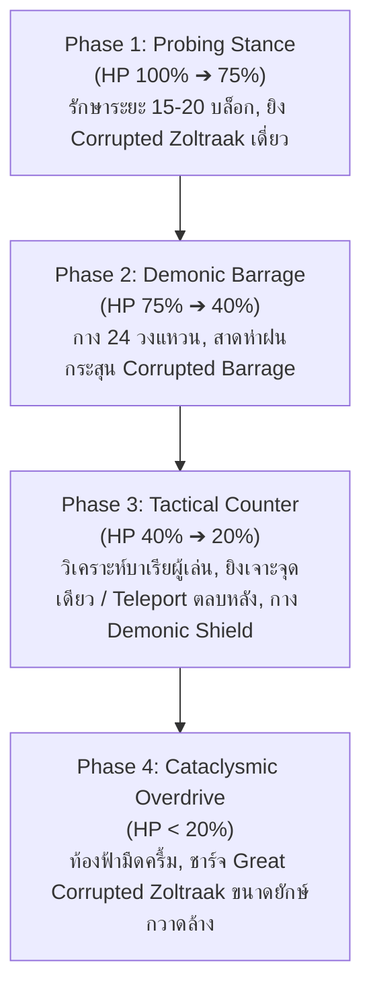

# 📜 พิมพ์เขียวการออกแบบบอส: มหาจอมเวทควาล (Qual / クヴァール)
### The Elder Sage of Corruption — Origin of Killing Magic (Zoltraak)
**สำหรับ Mod: Zoltraak Cinematic Edition (NeoForge 1.21.1 / Iron's Spells)**

---

## 1. ภูมิหลังและปรัชญาการออกแบบ (Lore & Design Philosophy)

### 1.1 ภูมิหลังตามเนื้อเรื่อง (Lore Accuracy)
- **มหาจอมเวทควาล (Qual / クヴァール - Fuhai no Kenrō)**: หนึ่งในยอดจอมเวทเผ่ามารที่ทรงพลังที่สุดในยุคของราชาปีศาจเมื่อ 80 ปีก่อน ผู้คิดค้น **เวทมนตร์สังหาร (Killing Magic — ゾルトラーク / Zoltraak)** ดั้งเดิม
- ในยุคนั้น Zoltraak ของควาลเป็นเวทมนตร์ไร้เทียมทานที่เจาะทะลวงชุดเกราะและการป้องกันเวทมนตร์ทุกชนิดของมนุษย์ สังหารนักผจญภัยไปกว่า 40% และจอมเวทไปถึง 70% ในทวีปตอนเหนือ
- ปาร์ตี้ของผู้กล้าฮิมเมลไม่สามารถสังหารควาลได้ในเวลานั้น ฟรีเรนจึงใช้วิธี **"สะกดและปิดผนึก" (封印)** ควาลไว้ในศิลาเวทมนตร์
- **ลักษณะนิสัยและการต่อสู้**: ควาลไม่ใช่ปีศาจที่ใช้เพียงกำลังดิบ แต่เป็น **"ปราชญ์จอมเวท" (Sage)** ที่เยือกเย็น สุขุม และมีความสามารถในการวิเคราะห์ทฤษฎีเวทมนตร์ของคู่ต่อสู้อย่างรวดเร็ว หากคู่ต่อสู้กางโล่บาเรีย ควาลจะวิเคราะห์โครงสร้างเวทมนตร์ของโล่ทันทีและปรับการโจมตีเพื่อหาจุดบกพร่อง

---

## 2. ข้อมูลสถิติพื้นฐานของบอส (Boss Attributes & Stats)

| หัวข้อ | ค่าสเปก (Specification) | รายละเอียดเชิงเทคนิค |
| :--- | :--- | :--- |
| **Entity ID** | `zoltraak_cinematic:qual_boss` | คลาส `QualBossEntity` |
| **ประเภท (Category)** | `Monster` (Boss) | รองรับ `ServerBossEvent` |
| **พลังชีวิตสูงสุด (Max HP)** | **1500 HP**  | ปรับสเกลตามผู้เล่นในบริเวณใกล้เคียง (+200 HP ต่อคน) |
| **เกราะป้องกัน (Armor)** | 30 หน่วย, Armor Toughness: 10 | ทนทานต่อการโจมตีทางกายภาพสูง |
| **การต้านทานเวท (Magic Resist)** | **+40%** | ลดดาเมจจากเวทมนตร์ทั่วไป แต่แพ้ทาง Ordinary Magic |
| **การเคลื่อนที่ (Movement)** | **3D Demonic Flight** กลางอากาศ 100% | ไม่เดินบนพื้น, ลอยตัว 4–15 บล็อกเหนือพื้นดินเสมอ |
| **ขนาด Hitbox** | กว้าง 1.4 บล็อก, สูง 3.2 บล็อก | รูปร่างสูงใหญ่และน่าเกรงขามกว่าผู้เล่นปกติ |
| **แถบหลอดเลือด (Boss Bar)** | สีม่วงเข้ม (`BossBarColor.PURPLE`), สไตล์ `PROGRESS` | `✦ มหาจอมเวทควาล (Qual, Elder Sage of Corruption) ✦` |

---

## 3. รูปลักษณ์ โมเดล และแอนิเมชัน (Visual Appearance & Animations)

### 3.1 รูปทรงโมเดล (3D Model Anatomy)

1. **ส่วนหัวและเขาคู่ยักษ์ (Demonic Horns & Skull)**:
   - เขาคู่ขนาดมหึมาโค้งขึ้นและบิดออกด้านข้างตามแบบฉบับในอนิเมะ
   - ใบหน้าเป็นเงามืดลึกลับ มีเพียง **ดวงตาสีม่วงแดงเรืองแสง 2 ดวง** (`Emissive Glow`)
2. **ผ้าคลุมและร่างเงา (Tattered Demonic Cloak)**:
   - สวมผ้าคลุมสีดำอมม่วงเข้มขาดรุ่ยหลายแฉกที่พริ้วไหวตามกระแสลมและแรงบินตลอดเวลา
   - ปลายผ้าคลุมแผ่ละอองออร่าความมืด (Dark Corruption Particles)
3. **มือและแขนร่ายเวท (Spellcasting Arms)**:
   - กรงเล็บยาวสีดำสนิท มีวงแหวนเวทมนตร์ปีศาจเรืองแสงที่ข้อมือขณะร่ายเวท

### 3.2 ชุดแอนิเมชันหลัก (Animations)
- **`idle_flight`**: ลอยตัวลอยขึ้นลงอย่างสง่างาม ชายผ้าคลุมสะบัดตามแรงลม
- **`cast_beam`**: ยื่นแขนขวาตรงไปข้างหน้า เกิดวงแหวนเวทมนตร์ปีศาจหมุนวนที่ฝ่ามือ ก่อนยิงลำแสง
- **`cast_barrage`**: กางแขนทั้งสองข้างออก วงแหวนเวทสีดำ-ม่วง 24 วงปรากฏลอยล้อมรอบตัว
- **`analyze_barrier`**: เอียงคอมองโล่บาเรียของผู้เล่น พร้อมมีเส้นสายเวทมนตร์สีม่วงพุ่งไปสแกนโล่
- **`teleport_dash`**: สลายร่างกลายเป็นกลุ่มควันสีดำ แล้วพุ่งไปปรากฏตัวอีกจุดหนึ่งอย่างรวดเร็ว
- **`death`**: ชะงักนิ่ง ลำตัวเริ่มแตกร้าวเป็นประกายแสงสีม่วงทะลักออกจากร่าง ก่อนจะระเบิดเป็นละอองเวทมนตร์จางหายไป

---

## 4. ระบบการต่อสู้ 4 เฟส (4-Phase Combat Progression)



### 4.1 Phase 1: ลอยตัวหยั่งเชิง (Probing Stance / HP 100% – 75%)
- **พฤติกรรม AI**: บินรักษาระยะห่าง 15–20 บล็อก เคลื่อนที่วนรอบตัวผู้เล่นอย่างเยือกเย็น
- **ท่าโจมตี**:
  - **Single Corrupted Zoltraak**: ยิงลำแสงโซลทราคสีดำ-ม่วงทมิฬแบบเดี่ยว ดาเมจสูง ทะลวงเกราะกายภาพ
  - **Dark Energy Dart**: ยิงกระสุนพลังงานสีดำ 3 นัดติดต่อกันเพื่อทดสอบปฏิกิริยาของผู้เล่น

### 4.2 Phase 2: คลื่นห่าฝนวงแหวนมาร (Demonic Barrage Matrix / HP 75% – 40%)
- **พฤติกรรม AI**: บินไต่ระดับความสูงขึ้นสู่ระยะ 8–12 บล็อกเหนือพื้นดิน
- **ท่าโจมตี**:
  - **Corrupted Barrage (24 วงแหวน)**: กางวงแหวนเวทมนตร์สีดำ 24 วงรอบตัว แล้วยิงกระสุนโซลทราคแบบกระหน่ำต่อเนื่องด้วยความเร็วสูง
  - **Suppression Fire**: บังคับให้ผู้เล่นต้องกางโล่บาเรียป้องกัน หรือหาที่กำบัง

### 4.3 Phase 3: การปรับตัวทางกลยุทธ์ (Tactical Adaptation / HP 40% – 20%)
- **พฤติกรรม AI พิเศษ (Anti-Barrier Intelligence)**:
  - หากตรวจพบว่าผู้เล่นกาง **Defensive Magic (Honeycomb Barrier)**:
    - **Focused Beam**: ควาลจะรวบรวมพลังทั้งหมด ยิงลำแสงอัดกระแทกลงบนแผ่นหกเหลี่ยมจุดเดิมซ้ำๆ เพื่อเร่งให้เกราะแตกเร็วขึ้น
    - **Shadow Blink (Flank Teleport)**: ควาลจะเทเลพอร์ตสลายร่างเป็นควันดำ ข้ามไปด้านหลังหรือด้านข้างของผู้เล่นทันที 8–12 บล็อก เพื่อยิงทะลวงจุดบอดของโล่แบน (Directional Shield)!
  - **Qual's Demonic Barrier**: เมื่อผู้เล่นยิง Zoltraak หรือเวทมนตร์สวนกลับ ควาลจะกางโล่เวทมนตร์สีดำทรงกลมสะท้อน/ดูดซับดาเมจได้บางส่วน

### 4.4 Phase 4: ทะลุขีดจำกัดก่อนสิ้นชีพ (Cataclysmic Overdrive / HP < 20%)
- **บรรยากาศ (Atmosphere)**: ท้องฟ้าในบริเวณรัศมี 64 บล็อกจะมืดครึ้มลง พร้อมมีสายฟ้ามานาสีม่วงฟาดลงรอบสนามรบ
- **ท่าไม้ตาย**:
  - **Original Cataclysmic Zoltraak (มหาเวทสังหารไร้ขีดจำกัด)**: ชาร์จพลังงาน 3.0 วินาที เกิดวงแหวนเวทมนตร์ 3 ชั้นขนาดยักษ์ด้านหน้า แล้วยิงลำแสงขนาดเส้นผ่านศูนย์กลาง 4 บล็อก กวาดทำลายทุกสิ่งในแนวราบ 60 บล็อก
  - ผู้เล่นต้องใช้โล่โดม 360 องศา (Geodesic Dome) หรือหลบหลังภูมิประเทศเพื่อเอาชีวิตรอด

---

## 5. ระบบโครงสร้างและการอัญเชิญ (Structure & Summoning Ritual)

### 5.1 โครงสร้างศิลาผนึกโบราณ (Qual's Sealing Monolith)
- **ตำแหน่งที่พบ**: เจนเนอเรตในป่าทึบโบราณ (`Old Growth Birch Forest`, `Dark Forest`, `Old Growth Pine Taiga`)
- **ลักษณะโครงสร้าง**:
  - ลานหินโบราณทรงกลมที่ปกคลุมด้วยเถาวัลย์และมอส
  - ตรงกลางมี **"ศิลาสะกดมารของฟรีเรน" (Frieren's Sealing Monolith Block)** สลักลายวงเวทมนตร์สีฟ้าของมนุษย์
  - มีแท่งหินเวทมนตร์ 4 ทิศรอบศิลา ปล่อยประกายโซ่ตรวนเวทมนตร์ล่ามตรึงศิลาไว้

### 5.2 พิธีคลายผนึก (Unsealing Ritual)
1. **เงื่อนไข**: ผู้เล่นถือ `Grimoire of Ordinary Magic` หรือใช้คทาเวทมนตร์ คลิกขวาที่ศิลาสะกด
2. **ลำดับเหตุการณ์ (Cutscene & VFX Progression)**:
   - **0.0s – 2.0s**: วงแหวนเวทมนตร์สีฟ้าบนศิลาเริ่มกระพริบถี่และเปลี่ยนเป็นสีแดง
   - **2.0s – 3.5s**: เกิดเสียงแตกร้าวของผลึกคริสตัล โซ่ตรวนเวทมนตร์ทั้ง 4 ทิศแตกสลาย
   - **3.5s – 5.0s**: ลำแสงพลังงานสีดำ-ม่วงพุ่งทะลวงขึ้นสู่ท้องฟ้า เกิดแรงสั่นสะเทือน (Camera Kickback)
   - **5.0s**: ศิลาระเบิดออก มหาจอมเวทควาลลอยตัวขึ้นสู่ท้องฟ้า พร้อมเสียงคำรามเวทมนตร์โบราณ และ Boss Bar ปรากฏขึ้น!

---

## 6. โครงสร้างสถาปัตยกรรมทางเทคนิค (Technical Architecture)

```
src/main/java/com/frierenflight/zoltraakcinematic/
├── entity/
│   ├── boss/
│   │   ├── QualBossEntity.java          # เอนทิตีหลักของบอส, Stats, BossBar, State Machine
│   │   └── ai/
│   │       ├── QualHoverGoal.java       # AI ลอยตัวและรักษาระดับการบิน 3D
│   │       ├── QualCastSpellGoal.java   # AI เลือกร่ายเวทตามเฟสการต่อสู้
│   │       ├── QualCounterBarrierGoal.java # AI ตรวจจับโล่ผู้เล่นและยิงเจาะ/เทเลพอร์ต
│   │       └── QualTeleportGoal.java    # AI เทเลพอร์ตหลบการโจมตี
│   └── block/
│       └── QualSealingStoneBlock.java   # บล็อกศิลาผนึกโบราณ
├── client/
│   ├── renderer/
│   │   ├── QualBossRenderer.java        # เรนเดอร์โมเดลบอส, ชิ้นส่วนเรืองแสง, Shader Pass
│   │   └── layer/
│   │       └── QualEmissiveEyeLayer.java# เลเยอร์ดวงตาและเขาสะท้อนแสง Bloom ในที่มืด
│   └── model/
│       └── QualBossModel.java           # โมเดลและกระดูกการขยับของควาล
└── registry/
    └── ModCinematicEntities.java        # ลงทะเบียน QUAL_BOSS
```

---

## 7. ของรางวัลและไอเทมพิเศษหลังปราบ (Loot & Rewards)

| ไอเทม | ประเภท | คุณสมบัติพิเศษ |
| :--- | :--- | :--- |
| **Grimoire of the Elder Sage**<br>*(บันทึกมหาเวทของควาล)* | Spellbook / Artifact | สมุดเวทมนตร์โบราณ 12 ช่องเวท, +40% Zoltraak Spell Power, ปลดล็อกสิทธิ์การร่ายเวทสาย Corrupted |
| **Horn of Corruption**<br>*(เขาของมหาจอมเวทควาล)* | Crafting Material | วัตถุดิบในตำนาน สำหรับคราฟต์ไม้เท้าปีศาจ หรือเครื่องรางเวทมนตร์ขั้นสูงสุด |
| **Qual's Core of Corruption**<br>*(แก่นแท้แห่งการเน่าเปื่อย)* | Curios Necklace | เครื่องประดับสวมใส่: เพิ่มระยะลำแสง Zoltraak +50%, ลดการเผาผลาญมานาของเวทบินลง 25% |
| **Trophy / Boss Head**<br>*(รูปปั้นจำลองเขาของควาล)* | Decorative Trophy | วางประดับฐาน มีออร่าละอองเวทสีม่วงเรืองแสงรอบตัว |

---

## 8. แผนงานการพัฒนาเป็นลำดับขั้นตอน (Action Roadmap)

- [ ] **Phase 1: Entity & Base Flight** — สร้าง `QualBossEntity.java`, สถิติพื้นฐาน, การบิน 3D Hovering และ Boss Bar
- [ ] **Phase 2: Combat Spellcasting AI** — นำ `CORRUPTED_ZOLTRAAK` และ `CORRUPTED_BARRAGE` มาผูกเข้ากับ AI การร่ายเวท 4 เฟส
- [ ] **Phase 3: Anti-Barrier Tactics** — พัฒนา AI ตรวจจับ `DefenseBarrierEntity` เพื่อยิงเจาะจุดเดียวหรือเทเลพอร์ตอ้อมไปยิงด้านหลัง
- [ ] **Phase 4: Model & Emissive Shaders** — ปั้นโมเดล Blockbench, ลงเทกเจอร์ และทำเลเยอร์เรืองแสง (Emissive Bloom) เข้ากับ Iris Shaders
- [ ] **Phase 5: Sealing Monolith Structure** — สร้างบล็อกศิลาผนึก, โครงสร้างในป่า และอีเวนต์ Cutscene ปลดผนึก
- [ ] **Phase 6: Loot & Polish** — กำหนด Loot Table, เสียงพากย์เวทมนตร์, เอฟเฟกต์ และความสำเร็จ (Advancement)
